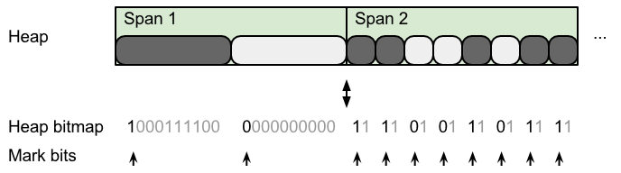
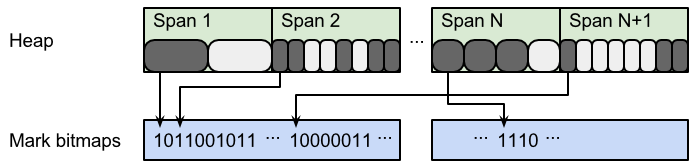
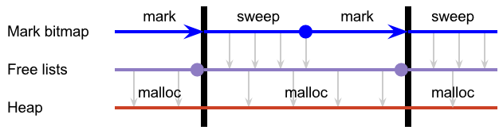
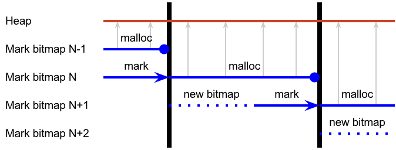
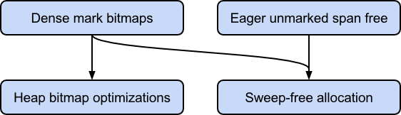

# Proposal: Dense mark bits and sweep-free allocation

or, *How I learned to stop worrying and love the bitmap*

Author: Austin Clements

Last updated: 2015-09-30

Discussion at https://golang.org/issue/12800.

## Abstract

This document proposes a change to memory allocation to eliminate the
need for the sweeper and a new representation for the mark bitmap that
enables this. This reduces the cost of allocation, significantly
improves the locality of the mark bitmap, and paves the way for future
advances to the Go GC that require multiple mark bits.

## Background

All current releases of Go up to and including Go 1.5 use a
*mark-sweep* garbage collector. As of Go 1.5, this works by
alternating between a mostly-concurrent mark phase and a concurrent
sweep phase. The mark phase finds all reachable objects and *marks*
them, leaving all unreachable objects *unmarked*. The sweep phase
walks through the entire heap, finds all unmarked objects, and adds
them to free lists, which the allocator in turn uses to allocate new
objects.

However, this sweep phase is, in a sense, redundant. It primarily
transforms one representation of the free heap—the mark bits—into
another representation of the free heap—the free lists. Not only does
this take time, but the free list representation is unfriendly to
modern CPUs since it is not very cacheable and accesses to it are hard
to predict. Furthermore, the current mark representation is also
cache-unfriendly, which adds even more to the cost of sweeping.

This document proposes a design for eliminating the sweeper. The key
idea is to allocate directly using the mark bitmap, foregoing the free
list representation entirely. Doing this efficiently requires a new,
dense representation for mark bits that enables fast scanning and
clearing. This representation also makes it easy to maintain multiple
mark bitmaps simultaneously. We introduce the dense bitmap
representation first. We then present a simple system for allocation
based on two mark bitmaps that eliminates the free list and hence the
need for the sweeper.

## Motivation

Typical Go programs spend about 5% of their CPU in the sweeper or in
cache misses induced by the free list representation. Hence, if we can
significantly reduce or eliminate the cost of the sweeping from
allocation and improve the free set representation, we can improve
overall program performance.

To measure this, we ran the go1 benchmark suite, just the BinaryTree17
benchmark with `-benchtime 5s`, and the x/benchmarks garbage benchmark
with `-benchmem 1024`. These represent a range of CPU-intensive and
allocation-intensive benchmarks. In all cases, GOMAXPROCS is 4. The
CPU time breaks down as follows:

|     | go1 (all) | BinaryTree17 | garbage 1GB |
| --- | ---------:| ------------:| -----------:|
| CPU in mark                                       |  2.8% |  4.0% | 34.7% |
| CPU in sweep                                      |  3.3% | 20.6% |  5.2% |
| CPU in mallocgc (excl. sweep, GC)                 |  6.8% | 39.0% | 15.8% |
| &emsp;&emsp;% of mallocgc spent walking free list | 19.2% | 17.5% | 14.3% |

(Times were collected using pprof. mark shows samples matching
`\.gc$|gcBgMarkWorker|gcAssistAlloc|gchelper`. sweep shows
`mSpan_Sweep`. mallocgc shows `mallocgc -gcAssistAlloc -mSpan_Sweep`.)

This proposal replaces sweepone with a scan that should require
roughly 1ms of CPU time per heap GB per GC cycle. For BinaryTree17,
that’s less than 0.1% of its CPU time, versus 21% for the current
sweep. It replaces the cost of walking the free list in mallocgc with
what is likely to be a smaller cost of sequentially scanning a bitmap.
It’s likely to have negligible effect on mark performance. Finally, it
should increase the heap footprint by roughly 0.02%.

## Dense mark bitmaps

Currently, the mark bits are stored in the *heap bitmap*, which is a
structure that stores two bits for every word of the heap, using a
simple formula to map between a heap address and a bitmap address. The
mark bit is stored in one of the bits for the first word of every
object. Because mark bits are "on the side," spans can be efficiently
subdivided into smaller object sizes (especially power-of-two sizes).
However, this sparse bitmap is expensive to scan and clear, as it
requires a strided, irregular traversal of memory, as shown in
figure 1. It also makes it difficult (albeit not impossible) to
maintain two sets of mark bits on word-sized objects, which is
necessary for sweep-free allocation.

**Figure 1.** In Go 1.5, mark bits are sparse and irregularly strided.

Therefore, this proposal separates the mark bits from the heap bitmap
into a dedicated mark bitmap structure. The difficulty here is,
because objects are different sizes and a given span can be freed and
reused for a different size class any number of times, a dense mark
bitmap cannot be addressed solely based on an object’s address. It
must be indirected through the object’s span.

One solution is to store the mark bits for the objects in each span as
a dense bit array in the span itself, either before or after the
objects. This dense representation is more efficient to scan and clear
than the sparse representation, but still requires visiting every span
to do so. Furthermore, it increases memory fragmentation, especially
for power-of-two allocations, which currently have zero external
fragmentation.

We propose maintaining a dense mark bitmap, but placing it outside of
the spans and in mostly contiguous memory by allocating the mark
bitmap anew *for every GC cycle*. In both the current sparse bitmap
and the strawman dense bitmap above, an object’s mark bit is in the
same location for the lifetime of that object. However, an object’s
mark only needs to persist for two GC cycles. By allocating the mark
bitmap anew for each GC cycle, we can avoid impacting span
fragmentation and use contiguous memory to enable bulk clearing of the
bitmap. Furthermore, discarding and recreating the bitmap on every
cycle lets us use a trivial scheme for allocating mark bitmaps to
spans while simultaneously dealing with changing heap layouts: even
though spans are reused for different size classes, any given span can
change size class at most once per GC cycle, so there’s no need for
sophisticated management of a mark bitmap that will only last two
cycles.

Between GC cycles, the runtime will prepare a fresh mark bitmap for
the upcoming mark phase, as shown in figure 2. It will traverse the
list of in-use spans and use a simple arena-style linear allocator to
assign each span a mark bitmap sized for the number of objects in that
span. The arena allocator will obtain memory from the system in
reasonably large chunks (e.g., 64K) and bulk zero it. Likewise, any
span that transitions from free to in-use during this time will also
be allocated a mark bitmap.

**Figure 2.** Proposed arena allocation of dense mark bitmaps. For
illustrative purposes, bitmaps are shown allocated without alignment
constraints.

When the mark phase begins, all in-use spans will have zeroed mark
bitmaps. The mark phase will set the mark bit for every reachable
object. Then, during mark termination, the garbage collector will
transfer this bitmap to the allocator, which can use it to find free
objects in spans that were in-use at the beginning of the mark phase.
Any spans that are allocated after the mark phase (including after
mark termination) will have a nil allocation bitmap, which is
equivalent to all objects in that span being unmarked and allows for
bump-pointer allocation within that span. Finally, when the allocator
is done with the mark bitmap, the whole arena can be bulk freed.

## Dense mark bitmap performance

The entire process of allocating and clearing the new mark bitmap will
require only about 1 ms of CPU time per heap GB. Walking the list of
in-use spans requires about 1 ms per heap GB and, thanks to the arena
allocation, zeroing the bitmap should add only 40 µs per heap GB,
assuming 50 GB/sec sequential memory bandwidth and an average object
size of 64 bytes.

Furthermore, the memory overhead of the mark bitmap is minimal. The
instantaneous average object size of "go build std" and "go test
-short std" is 136 bytes and 222 bytes, respectively. At these sizes,
and assuming two bitmaps, the mark bitmaps will have an overhead of
only 0.18% (1.9 MB per heap GB) and 0.11% (1.2 MB per heap GB),
respectively. Even given a very conservative average object size of 16
bytes, the overhead is only 1.6% (16 MB per heap GB).

Dense mark bits should have negligible impact on mark phase
performance. Because of interior pointers, marking an object already
requires looking up that object’s span and dividing by the span’s
object size to compute the object index. With the sparse mark bitmap,
it requires multiplying and adding to compute the object’s base
address; three subtractions, three shifts, and a mask to compute the
location and value of the mark bit; and a random atomic memory write
to set the mark bit. With the dense mark bitmap, it requires reading
the mark bitmap pointer from the span (which can be placed on the same
cache line as the metadata already read); an addition, two shifts, and
a mask to compute the location and value of the mark bit; and a random
atomic memory write to set the mark bit.

Dense mark bits should simplify some parts of mark that currently
require checks and branches to treat the heap bitmap for the first two
object words differently from the heap bitmap for the remaining words.
This may improve branch predictor behavior and hence performance of
object scanning.

Finally, dense mark bits may slightly improve the performance of
unrolling the heap bitmap during allocation. Currently, small objects
require atomic writes to the heap bitmap because they may race with
the garbage collector marking objects. By separating out the mark
bits, the sole writer to any word of the heap bitmap is the P
allocating from that span, so all bitmap writes can be non-atomic.

## Sweep-free allocation

The key idea behind eliminating the sweeper is to use the mark bitmap
directly during allocation to find free objects that can be
reallocated, rather than transforming this bitmap into a free list and
then allocating using the free list. However, in a concurrent garbage
collector some second copy of the heap free set is necessary for the
simple reason that the mutator continues to allocate objects from the
free set at the same time the concurrent mark phase is constructing
the new free set.

In the current design, this second copy is the free list, which is
fully constructed from the mark bits by the time the next mark phase
begins. This requires essentially no space because the free list can
be threaded through the free objects. It also gives the system a
chance to clear all mark bits in preparation for the next GC cycle,
which is expensive in the sparse mark bitmap representation, so it
needs to be done incrementally and simultaneously with sweeping the
marks. The flow of information in the current sweeper is shown in
figure 3.

**Figure 3.** Go 1.5 flow of free object information.

We propose simply using two sets of mark bits. At the end of the mark
phase, the object allocator switches to using the mark bitmap
constructed by the mark phase and the object allocator’s current mark
bitmap is discarded. During the time between mark phases, the runtime
allocates and bulk zeroes the mark bitmap for the next mark phase. The
flow of information about free objects in this design is shown in
figure 4.

**Figure 4.** Proposed flow of free object information.

To allocate an object, the object allocator obtains a cached span or
allocates a new span from the span allocator as it does now. The span
allocator works much like it does now, with the exception that where
the span allocator currently sweeps the span, it will now simply reset
its bitmap pointer to the beginning of the span’s bitmap. With a span
in hand, the object allocator scans its bitmap for the next unmarked
object, updates the span’s bitmap pointer, and initializes the object.
If there are no more unmarked objects in the span, the object
allocator acquires another span. Note that this may happen repeatedly
if the allocator obtains spans that are fully marked (in contrast,
this is currently handled by the sweeper, so span allocation will
never return a fully marked span).

Most likely, it makes sense to cache an inverted copy of the current
word of the bitmap in the span. Allocation can then find the next set
bit using processor ctz intrinsics or efficient software ctz and bit
shifts to maintain its position in the word. This also simplifies the
handling of fresh spans that have nil allocation bitmaps.

### Finalizers

One complication of this approach is that sweeping is currently also
responsible for queuing finalizers for unmarked objects. One solution
is to simply check the mark bits of all finalized objects between GC
cycles. This could be done in the same loop that allocates new mark
bits to all spans after mark termination, and would add very little
cost. In order to do this concurrently, if the allocator obtained a
span before the garbage collector was able to check it for finalizers,
the allocator would be responsible for queuing finalizers for objects
on that span.

## Compatibility

This proposal only affects the performance of the runtime. It does not
change any user-facing Go APIs, and hence it satisfies Go 1
compatibility.

## Implementation

This work will be carried out by Austin Clements and Rick Hudson
during the Go 1.6 development cycle.

Figure 5 shows the components of this proposal and the dependencies
between implementing them.

**Figure 5.** Implementation dependency diagram.

We will implement dense mark bitmaps first because it should be fairly
easy to update the current sweeper to use the dense bitmaps and this
will enable multiple mark bitmaps. We will then build sweep-free
allocation on top of this. Sweep-free allocation makes it difficult to
detect completely unmarked spans and return them to the span
allocator, so we will most likely want to implement eager freeing of
unmarked spans first, as discussed in issue
[#11979](https://golang.org/issue/11979), though this is not strictly
necessary. At any point after dense mark bitmaps are in place, we can
implement the optimizations to the heap bitmap discussed in "Dense
mark bitmap performance."

## Related work

Dense mark bitmaps have a long history in garbage collectors that use
segregated-fits allocation. The Boehm conservative collector
[Boehm, 1988] used dense mark bitmaps, but stored each span’s bitmap
along with that span’s objects, rather than as part of large,
contiguous allocations. Similarly, Garner [2007] explores a mark-sweep
collector that supports both mark bits in object headers and dense
"side bitmaps." Garner observes the advantages of dense mark bitmaps
for bulk zeroing, and concludes that both approaches have similar
marking performance, which supports our prediction that switching to
dense mark bitmaps will have negligible impact on mark phase
performance.

Traditionally, mark-sweep garbage collectors alternate between marking
and sweeping. However, there have various approaches to enabling
simultaneous mark and sweep in a concurrent garbage collector that
closely resemble our approach of allowing simultaneous mark and
allocation. Lamport [1976] introduced a "purple" extension to the
traditional tri-color abstraction that made it possible for the
sweeper to distinguish objects that were not marked in the previous
mark phase (and hence should be swept) from objects that are not yet
marked in the current mark phase, but may be marked later in the
phase. To reduce the cost of resetting these colors, Lamport’s
algorithm cycles through three different interpretations of the color
encoding. In contrast, our approach adheres to the tri-color
abstraction and simply alternates between two different bitmaps. This
means we have to reset the colors for every mark phase, but we arrange
the bitmap such that this cost is negligible. Queinnec’s "mark during
sweep" algorithm [Queinnec, 1989] alternates between two bitmaps like
our approach. However, unlike our approach, both Queinnec and Lamport
still depend on a sweeper to transform the mark bits into a free list
and to reset the mark bits back to white.

## Possible extensions

### 1-bit heap bitmap

With the mark bits no longer part of the heap bitmap, it’s possible we
could pack the heap bitmap more tightly, which would reduce its memory
footprint, improve cache locality, and may improve the performance of
the heap bitmap unroller (the most expensive step of malloc). One of
the two bits encoded in the heap bitmap for every word is a "dead"
bit, which forms a unary representation of the index of the last
pointer word of the object. Furthermore, it’s always safe to increase
this number (this is how we currently steal a bit for the mark bit).
We could store this information in base 2 in an object-indexed
structure and reduce overhead by only storing it for spans with a
sufficiently large size class (where the dead bit optimization
matters). Alternatively, we could continue storing it in unary, but at
lower fidelity, such as one dead bit per eight heap words.

### Reducing atomic access to mark bitmap

If the cost of atomically setting bits in the mark bitmap turns out to
be high, we could instead dedicate a byte per object for the mark.
This idea is mentioned in GC literature [Garner, 2007]. Obviously,
this involves an 8× increase in memory overhead. It’s likely that on
modern hardware, the cost of the atomic bit operation is small, while
the cost of increasing the cache footprint of the mark structure is
probably large.

Another way to reduce atomic access to the mark bitmap is to keep an
additional mark bitmap per P. When the garbage collector checks if an
object is marked, it first consults the shared bitmap. If it is not
marked there, it updates the shared bitmap by reading the entire word
(or cache line) containing the mark bit from each per-P mark bitmap,
combining these words using bitwise-or, and writing the entire word to
the shared bitmap. It can then re-check the bit. When the garbage
collector marks an object, it simply sets the bit in its per-P bitmap.

## References

Hans-Juergen Boehm and Mark Weiser. 1988. Garbage collection in an
uncooperative environment. Software Practice and Experience 18, 9
(September 1988), 807–820.

Robin Garner, Stephen M. Blackburn, and Daniel Frampton. 2007.
Effective prefetch for mark-sweep garbage collection. In Proceedings
of the 6th international symposium on Memory management (ISMM '07).
ACM, New York, NY, USA, 43–54.

Leslie Lamport. 1976. Garbage collection with multiple processes: An
exercise in parallelism. In International Conference on Parallel
Processing (ICPP). 50–54.

Christian Queinnec, Barbara Beaudoing, and Jean-Pierre Queille. 1989.
Mark DURING Sweep rather than Mark THEN Sweep. In Proceedings of the
Parallel Architectures and Languages Europe, Volume I: Parallel
Architectures (PARLE '89), Eddy Odijk, Martin Rem, and Jean-Claude
Syre (Eds.). Springer-Verlag, London, UK, UK, 224–237.
