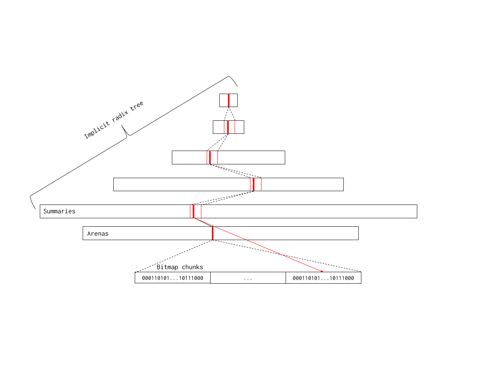
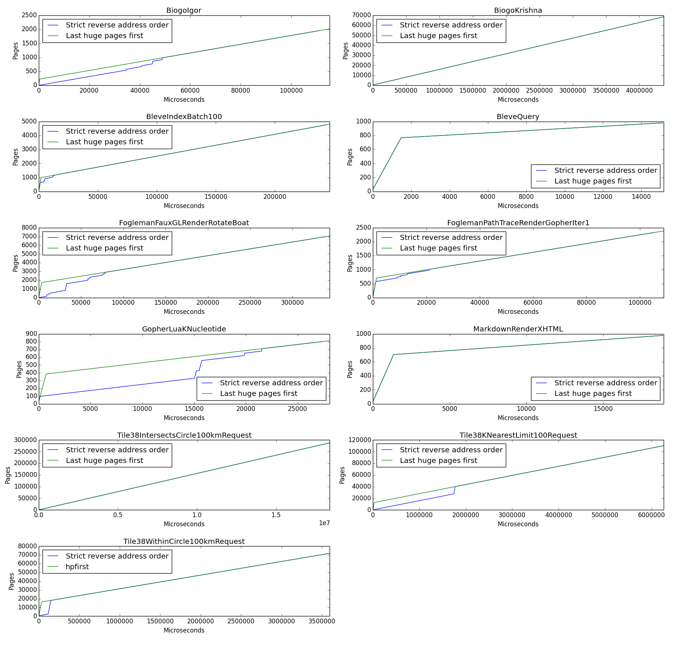

# Proposal: Scaling the Go page allocator

Author(s): Michael Knyszek, Austin Clements

Last updated: 2019-10-18

## Abstract

The Go runtime's page allocator (i.e. `(*mheap).alloc`) has scalability
problems.
In applications with a high rate of heap allocation and a high GOMAXPROCS,
small regressions in the allocator can quickly become big problems.

Based on ideas from Austin about making P-specific land-grabs to reduce lock
contention, and with evidence that most span allocations are one page in size
and are for small objects (<=32 KiB in size), I propose we:
  1. Remove the concept of spans for free memory and track free memory with a
     bitmap.
  1. Allow a P to cache free pages for uncontended allocation.
Point (1) simplifies the allocator, reduces some constant overheads, and more
importantly enables (2), which tackles lock contention directly.

## Background

The Go runtime's page allocator (i.e. `(*mheap).alloc`) has serious scalability
issues.
These were discovered when working through
[golang/go#28479](https://github.com/golang/go/issues/28479) and
[kubernetes/kubernetes#75833](https://github.com/kubernetes/kubernetes/issues/75833#issuecomment-477758829)
which were both filed during or after the Go 1.12 release.
The common thread between each of these scenarios is a high rate of allocation
and a high level of parallelism (in the Go world, a relatively high GOMAXPROCS
value, such as 32).

As it turned out, adding some extra work for a small subset of allocations in Go
1.12 and removing a fast-path data structure in the page heap caused significant
regressions in both throughput and tail latency.
The fundamental issue is the heap lock: all operations in the page heap
(`mheap`) are protected by the heap lock (`mheap.lock`).
A high allocation rate combined with a high degree of parallelism leads to
significant contention on this lock, even though page heap allocations are
relatively cheap and infrequent.
For instance, if the most popular allocation size is ~1 KiB, as seen with the
Kubernetes scalability test, then the runtime accesses the page heap every 10th
allocation or so.

The proof that this is really a scalability issue in the design and not an
implementation bug in Go 1.12 is that we were seeing barging behavior on this
lock in Go 1.11, which indicates that the heap lock was already in a collapsed
state before the regressions in Go 1.12 were even introduced.

## Proposal

I believe we can significantly improve the scalability of the page allocator if
we eliminate as much lock contention in the heap as possible. We can achieve
this in two ways:
  1. Make the allocator faster.
     The less time spent with the lock held the better the assumptions of e.g.
     a futex hold up.
  1. Come up with a design that avoids grabbing the lock at all in the common
     case.

So, what is this common case? We currently have span allocation data for a
couple large Go applications which reveal that an incredibly high fraction of
allocations are for small object spans.
First, we have data from Kubernetes' 12-hour load test, which indicates that
99.89% of all span allocations are for small object spans, with 93% being from
the first 50 size classes, inclusive.
Next, data from a large Google internal service shows that 95% of its span
allocations are for small object spans, even though this application is known to
make very large allocations relatively frequently.
94% of all of this application's span allocations are from the first 50 size
classes, inclusive.

Thus, I propose we:
  * Track free pages in a bitmap that spans the heap's address space.
  * Allow a P to cache a set of bits from the bitmap.

The goal is to have most (80%+) small object span allocations allocate quickly,
and without a lock.
(1) makes the allocator significantly more cache-friendly, predictable, and
enables (2), which helps us avoid grabbing the lock in the common case and
allows us to allocate a small number of pages very quickly.

Note that this proposal maintains the current first-fit allocation policy and
highest-address-first scavenging policy.

### Tracking free memory with bitmaps

With a first-fit policy, allocation of one page (the common case) amounts to
finding the first free page in the heap. One promising idea here is to use a
bitmap because modern microarchitectures are really good at iterating over bits.
Each bit in the bitmap represents a single runtime page (8 KiB as of this
writing), where 1 means in-use and 0 means free. "In-use" in the context of the
new page allocator is now synonymous with "owned by a span".
The concept of a free span isn't useful here.

I propose that the bitmap be divided up into shards each representing a single
arena.
Each shard would then live in its corresponding `heapArena` instance.
For a 64 MiB arena and 8 KiB page size, this means 8192 bits (1 KiB) per arena.
The main reason for sharding it in this way is for convenience in
implementation.
An alternative could be to maintain one large global bitmap and to map it in as
needed.

Simply iterating over one large bitmap is still fairly inefficient, especially
for dense heaps.
We want to be able to quickly skip over completely in-use sections of the heap.
Therefore, I first propose we subdivide our shards further into chunks.
Next, instead of running over each chunk directly, I propose we attach summary
information to each chunk such that it's much faster to filter out chunks which
couldn't possibly satisfy the allocation.
We subdivide the shards further rather than just attaching summary information
to shards directly in order to keep bitmap iteration work consistent across
platforms (i.e. independent of arena size).

What should this summary information contain? I propose we augment each chunk
with three fields: `start, max, end uintptr`.
`start` represents the number of contiguous 0 bits at the start of this bitmap
shard.
Similarly, `end` represents the number of contiguous 0 bits at the end of the
bitmap shard.
Finally, `max` represents the largest contiguous section of 0 bits in the bitmap
shard.

The diagram below illustrates an example summary for a bitmap chunk.
The arrow indicates which direction addresses go (lower to higher).
The bitmap contains 3 zero bits at its lowest edge and 7 zero bits at its
highest edge.
Within the summary, there are 10 contiguous zero bits, which `max` reflects.

With these three fields, we can determine whether we'll be able to find a
sufficiently large contiguous free section of memory in a given arena or
contiguous set of arenas with a simple state machine.
Computing this summary information for an arena is less trivial to make fast,
and effectively amounts to a combination of a table to get per-byte summaries
and a state machine to merge them until we have a summary which represents the
whole chunk.
The state machine for `start` and `end` is mostly trivial.
`max` is only a little more complex: by knowing `start`, `max`, and `end` for
adjacent summaries, we can merge the summaries by picking the maximum of each
summary's `max` value and the sum of their `start` and `end` values.
I propose we update these summary values eagerly as spans are allocated and
freed.
For large allocations that span multiple arenas, we can zero out summary
information very quickly, and we really only need to do the full computation of
summary information for the ends of the allocation.

There's a problem in this design so far wherein subsequent allocations may end
up treading the same path over and over.
Unfortunately, this retreading behavior's time complexity is `O(heap * allocs)`.
We propose a simple solution to this problem: maintain a hint address.
A hint address represents an address before which there are definitely no free
pages in the heap.
There may not be free pages for some distance after it, hence why it is just a
hint, but we know for a fact we can prune from the search everything before that
address.
In the steady-state, as we allocate from the lower addresses in the heap, we can
bump the hint forward with every search, effectively eliminating the search
space until new memory is freed.
Most allocations are expected to allocate not far from the hint.

There's still an inherent scalability issue with this design: larger allocations
may require iterating over the whole heap, even with the hint address.
This scalability issue arises from the fact that we now have an allocation
algorithm with a time complexity linear in the size of the heap.
Modern microarchitectures are good, but not quite good enough to just go with
this.

Therefore, I propose we take this notion of a summary-per-chunk and extend it:
we can build a tree around this, wherein a given entry at some level of the
radix tree represents the merge of some number of summaries in the next level.
The leaf level in this case contains the per-chunk summaries, while each entry
in the previous levels may reflect 8 chunks, and so on.

This tree would be constructed from a finite number of arrays of summaries, with
lower layers being smaller in size than following layers, since each entry
reflects a larger portion of the address space.
More specifically, we avoid having an "explicit" pointer-based structure (think
"implicit" vs. "explicit" when it comes to min-heap structures: the former tends
to be an array, while the latter tends to be pointer-based).

Below is a diagram of the complete proposed structure.

The bottom two boxes are the arenas and summaries representing the full address
space.
Each red line represents a summary, and each set of dotted lines from a summary
into the next layer reflects which part of that next layer that summary refers
to.

In essence, because this tree reflects our address space, it is in fact a radix
tree over addresses.
By left shifting a memory address by different amounts, we can find the exact
summary which contains that address in each level.

On allocation, this tree may be searched by looking at `start`, `max`, and `end`
at each level: if we see that `max` is large enough, we continue searching in
the next, more granular, level.
If `max` is too small, then we look to see if there's free space spanning two
adjacent summaries' memory regions by looking at the first's `end` value and the
second's `start` value.
Larger allocations are therefore more likely to cross larger boundaries of the
address space are more likely to get satisfied by levels in the tree which are
closer to the root.
Note that if the heap has been exhausted, then we will simply iterate over the
root level, find all zeros, and return.

#### Implementation details

A number of details were omitted from the previous section for brevity, but
these details are key for an efficient implementation.

Firstly, note that `start, max, end uintptr` is an awkward structure in size,
requiring either 12 bytes or 24 bytes to store naively, neither of which fits
a small multiple of a cache line comfortably.
To make this structure more cache-friendly, we can pack them tightly into
64-bits if we constrain the height of the radix tree.
The packing is straight-forward: we may dedicate 21 bits to each of these
three numbers and pack them into 63 bits.
A small quirk with this scheme is that each of `start`, `max`, and `end` are
counts, and so we need to represent zero as well as the maximum value (`2^21`),
which at first glance requires an extra bit per field.
Luckily, in that case (i.e. when `max == 2^21`), then `start == max && max ==
end`.
We may use the last remaining bit to represent this case. A summary representing
a completely full region is also conveniently `uint64(0)` in this
representation, which enables us to very quickly skip over parts of the address
space we don't care about with just one load and branch.

As mentioned before, a consequence of this packing is that we need to place a
restriction on our structure: each entry in the root level of the radix tree may
only represent at most `2^21` 8 KiB pages, or 16 GiB, because we cannot
represent any more in a single summary.
From this constraint, it follows that the root level will always be
`2^(heapAddrBits - 21 - log2(pageSize))` in size in entries.
Should we need to support much larger heaps, we may easily remedy this by
representing a summary as `start, max, end uint32`, though at the cost of cache
line alignment and 1.5x metadata overhead.
We may also consider packing the three values into two `uint64` values, though
at the cost of twice as much metadata overhead.
Note that this concern is irrelevant on 32-bit architectures: we can easily
represent the whole address space with a tree and 21 bits per summary field.
Unfortunately, we cannot pack it more tightly on 32-bit architectures since at
least 14 bits are required per summary field.

Now that we've limited the size of the root level, we need to pick the sizes of
the subsequent levels.
Each entry in the root level must reflect some number of entries in the
following level, which gives us our fanout.
In order to stay cache-friendly, I propose trying to keep the fanout close to
the size of an L1 cache line or some multiple thereof.
64 bytes per line is generally a safe bet, and our summaries are 8 bytes wide,
so that gives us a fanout of 8.

Taking all this into account, for a 48-bit address space (such as how we treat
`linux/amd64` in the runtime), I propose the following 5-level array structure:
  * Level 0: `16384` entries (fanout = 1, root)
  * Level 1: `16384*8` entries (fanout = 8)
  * Level 2: `16384*8*8` entries (fanout = 8)
  * Level 3: `16384*8*8*8` entries (fanout = 8)
  * Level 4: `16384*8*8*8*8` entries (fanout = 8, leaves)

Note that level 4 has `2^48 bytes / (512 * 8 KiB)` entries, which is exactly the
number of chunks in a 48-bit address space.
Each entry at this level represents a single chunk.
Similarly, since a chunk represents 512, or 2^9 pages, each entry in the root
level summarizes a region of `2^21` contiguous pages, as intended.
This scheme can be trivially applied to any system with a larger address space,
since we just increase the size of the root level.
For a 64-bit address space, the root level can get up to 8 GiB in size, but
that's mostly virtual address space which is fairly cheap since we'll only
commit to what we use (see below).

For most heaps, `2^21` contiguous pages or 16 GiB per entry in the root level is
good enough.
If we limited ourselves to 8 entries in the root, we would still be able to
gracefully support up to 128 GiB (and likely double that, thanks to
prefetchers).
Some Go applications may have larger heaps though, but as mentioned before we
can always change the structure of a summary away from packing into 64 bits and
then add an additional level to the tree, at the expense of some additional
metadata overhead.

Overall this uses between KiB and hundreds of MiB of address space on systems
with smaller address spaces (~600 MiB for a 48-bit address space, ~12 KiB for a
32-bit address space).
For a full 64-bit address space, this layout requires ~37 TiB of reserved
memory.

At first glance, this seems like an enormous amount, but in reality that's an
extremely small fraction (~0.00022%) of the full address space. Furthermore,
this address space is very cheap since we'll only commit what we use, and to
reduce the size of core dumps and eliminate issues with overcommit we will map
the space as `PROT_NONE` (only `MEM_RESERVE` on Windows) and map it as
read/write explicitly when we grow the heap (an infrequent operation).

There are only two known adverse effects of this large mapping on Linux:
  1. `ulimit -v`, which restricts even `PROT_NONE` mappings.
  1. Programs like top, when they report virtual memory footprint, include
     `PROT_NONE` mappings.
In the grand scheme of things, these are relatively minor consequences.
The former is not used often, and in cases where it is, it's used as an
inaccurate proxy for limiting a process's physical memory use.
The latter is mostly cosmetic, though perhaps some monitoring system uses it as
a proxy for memory use, and will likely result in some harmless questions.

### Allow a P to cache bits from the bitmap

I propose adding a free page cache to each P.
The page cache, in essence, is a base address marking the beginning of a 64-page
aligned chunk, and a 64-bit bitmap representing free pages in that chunk.
With 8 KiB pages, this makes it so that at most each P can hold onto 512 KiB of
memory.

The allocation algorithm would thus consist of a P first checking its own cache.
If it's empty, it would then go into the bitmap and cache the first non-zero
chunk of 64 bits it sees, noting the base address of those 64 bits.
It then allocates out of its own cache if able.
If it's unable to satisfy the allocation from these bits, then it goes back and
starts searching for contiguous bits, falling back on heap growth if it fails.
If the allocation request is more than 16 pages in size, then we don't even
bother checking the cache.
The probability that `N` consecutive free pages will be available in the page
cache decreases exponentially as `N` approaches 64, and 16 strikes a good
balance between being opportunistic and being wasteful.

Note that allocating the first non-zero chunk of 64 bits is an equivalent
operation to allocating one page out of the heap: fundamentally we're looking
for the first free page we can find in both cases.
This means that we can and should optimize for this case, since we expect that
it will be extremely common.
Note also that we can always update the hint address in this case, making all
subsequent allocations (large and small) faster.

Finally, there's a little hiccup in doing this and that's that acquiring an
`mspan` object currently requires acquiring the heap lock, since these objects
are just taken out of a locked SLAB allocator.
This means that even if we can perform the allocation uncontended we still need
the heap lock to get one of these objects.
We can solve this problem by adding a pool of `mspan` objects to each P, similar
to the `sudog` cache.

### Scavenging

With the elimination of free spans, scavenging must work a little differently as
well.
The primary bit of information we're concerned with here is the `scavenged`
field currently on each span.
I propose we add a `scavenged` bitmap to each `heapArena` which mirrors the
allocation bitmap, and represents whether that page has been scavenged or not.
Allocating any pages would unconditionally clear these bits to avoid adding
extra work to the allocation path.

The scavenger's job is now conceptually much simpler.
It takes bits from both the allocation bitmap as well as the `scavenged` bitmap
and performs a bitwise-OR operation on the two to determine which pages are
"scavengable".
It then scavenges any contiguous free pages it finds in a single syscall,
marking the appropriate bits in the `scavenged` bitmap.
Like the allocator, it would have a hint address to avoid walking over the same
parts of the heap repeatedly.

Because this new algorithm effectively requires iterating over the heap
backwards, there's a slight concern with how much time it could take,
specifically if it does the scavenge operation with the heap lock held like
today.
Instead, I propose that the scavenger iterate over the heap without the lock,
checking the free and scavenged bitmaps optimistically.
If it finds what appears to be valid set of contiguous scavengable bits, it'll
acquire the heap lock, verify their validity, and scavenge.

We're still scavenging with the heap lock held as before, but scaling the
scavenger is outside the scope of this document (though we certainly have ideas
there).

#### Huge-page Awareness

Another piece of the scavenging puzzle is how to deal with the fact that the
current scavenging policy is huge-page aware.
There are two dimensions to this huge-page awareness: the runtime counts the
number of free and unscavenged huge pages for pacing purposes, and the runtime
scavenges those huge pages first.

For the first part, the scavenger currently uses an explicit ratio calculated
whenever the GC trigger is updated to determine the rate at which it should
scavenge, and it uses the number of free and unscavenged huge pages to determine
this ratio.

Instead, I propose that the scavenger releases memory one page at a time while
avoiding breaking huge pages, and it times how long releasing each page takes.
Given a 1% maximum time spent scavenging for the background scavenger, we may
then determine the amount of time to sleep, thus effectively letting the
scavenger set its own rate.
In some ways this self-pacing is more accurate because we no longer have to make
order-of-magnitude assumptions about how long it takes to scavenge.
Also, it represents a significant simplification of the scavenger from an
engineering perspective; there's much less state we need to keep around in
general.

The downside to this self-pacing idea is that we must measure time spent
sleeping and time spent scavenging, which may be funky in the face of OS-related
context switches and other external anomalies (e.g. someone puts their laptop in
sleep mode).
We can deal with such anomalies by setting bounds on how high or low our
measurements are allowed to go.
Furthermore, I propose we manage an EWMA which we feed into the time spent
sleeping to account for scheduling overheads and try to drive the actual time
spent scavenging to 1% of the time the goroutine is awake (the same pace as
before).

As far as scavenging huge pages first goes, I propose we just ignore this aspect
of the current scavenger simplicity's sake.
In the original scavenging proposal, the purpose of scavenging huge pages first
was for throughput: we would get the biggest bang for our buck as soon as
possible, so huge pages don't get "stuck" behind small pages.
There's a question as to whether this actually matters in practice: conventional
wisdom suggests a first-fit policy tends to cause large free fragments to
congregate at higher addresses.
By analyzing and simulating scavenging over samples of real Go heaps, I think
this wisdom mostly holds true.

The graphs below show a simulation of scavenging these heaps using both
policies, counting how much of the free heap is scavenged at each moment in
time.
Ignore the simulated time; the trend is more important.

With the exception of two applications, the rest all seem to have their free and
unscavenged huge pages at higher addresses, so the simpler policy leads to a
similar rate of releasing memory.
The simulation is based on heap snapshots at the end of program execution, so
it's a little non-representative since large, long-lived objects, or clusters
of objects, could have gotten freed just before measurement.
This misrepresentation actually acts in our favor, however, since it suggests
an even smaller frequency of huge pages appearing in the middle of the heap.

## Rationale

The purpose of this proposal is to help the memory allocator scale.
To reiterate: it's current very easy to put the heap lock in a collapsing state.
Every page-level allocation must acquire the heap lock, and with 1 KiB objects
we're already hitting that page on every 10th allocation.

To give you an idea of what kinds of timings are involved with page-level
allocations, I took a trace from a 12-hour load test from Kubernetes when I was
diagnosing
[kubernetes/kubernetes#75833](https://github.com/kubernetes/kubernetes/issues/75833#issuecomment-477758829).
92% of all span allocations were for the first 50 size classes (i.e. up and
including 8 KiB objects). Each of those, on average, spent 4.0µs in the critical
section with the heap locked, minus any time spent scavenging.
The mode of this latency was between 3 and 4µs, with the runner-up being between
2 and 3µs.
These numbers were taken with the load test built using Go 1.12.4 and from a
`linux/amd64` GCE instance.
Note that these numbers do not include the time it takes to acquire or release
the heap lock; it is only the time in the critical section.

I implemented a prototype of this proposal which lives outside of the Go
runtime, and optimized it over the course of a few days.
I then took heap samples from large, end-to-end benchmarks to get realistic
heap layouts for benchmarking the prototype.

The prototype benchmark then started with these heap samples and allocated out
of them until the heap was exhausted.
Without the P cache, allocations took only about 680 ns on average on a similar
GCE instance to the Kubernetes case, pretty much regardless of heap size.
This number scaled gracefully relative to allocation size as well.
To be totally clear, this time includes finding space, marking the space and
updating summaries.
It does not include clearing scavenge bits.

With the P cache included, that number dropped to 20 ns on average.
The comparison with the P cache isn't an apples-to-apples comparison since it
should include heap lock/unlock time on the slow path (and the k8s numbers
should too).
However I believe this only strengthens our case: with the P cache, in theory,
the lock will be acquired less frequently, so an apples-to-apples comparison
would be even more favorable to the P cache.

All of this doesn't even include the cost savings when freeing memory.
While I do not have numbers regarding the cost of freeing, I do know that the
free case in the current implementation is a significant source of lock
contention ([golang/go#28479](https://github.com/golang/go/issues/28479)).
Each free currently requires a treap insertion and maybe one or two removals for
coalescing.

In comparison, freeing memory in this new allocator is faster than allocation
(without the cache): we know exactly which bits in the bitmap to clear from the
address, and can quickly index into the arenas array to update them as well as
their summaries.
While updating the summaries still takes time, we can do even better by freeing
many pages within the same arena at once, amortizing the cost of this update.
In fact, the fast page sweeper that Austin added in Go 1.12 already iterates
over the heap from lowest to highest address, freeing completely free spans.
It would be straight-forward to batch free operations within the same heap arena
to achieve this cost amortization.

In sum, this new page allocator design has the potential to not only solve our
immediate scalability problem, but also gives us more headroom for future
optimizations compared to the current treap-based allocator, for which a number
of various caching strategies, have been designed and/or attempted.

### Fragmentation Concerns

The biggest way fragmentation could worsen with this design is as a result of
the P cache.
The P cache makes it so that allocation isn't quite exactly a serialized
single-threaded first-fit, and P may hold onto pages which another P may need
more.

In practice, given an in-tree prototype, we've seen that this fragmentation
scales with the number of P's, and we believe this to be a reasonable trade-off:
more processors generally require more memory to take advantage of parallelism.

### Prior Art

As far as prior art is concerned, there hasn't been much work put into bitmap
allocators in general.
The reason is likely because most other points in the design space for memory
management wouldn't really benefit from a bitmap-based page-level allocator.

Consider Go against other other managed languages with a GC: Go's GC sits in a
fairly unique point in the design space for GCs because it is a non-moving
collector.
Most allocators in other managed languages (e.g. Java) tend to be bump
allocators, since they tend to have moving and compacting GCs.

When considering non-GC'd languages, e.g C/C++, there has been very little work
in using bitmaps, except for a few niche cases such as [GPU-accelerated
allocation](https://arxiv.org/abs/1810.11765) and [real-time
applications](http://www.gii.upv.es/tlsf/).

A good point of comparison for Go's current page allocator is TCMalloc, and in
many ways Go's memory allocator is based on TCMalloc.
However, there are some key differences that arise as a result of Go's GC.
Notably, TCMalloc manages its per-CPU caches as arrays of pointers, rather than
through spans directly like Go does.
The reason for this, as far as I can tell, is because when a free occurs in
TCMalloc, that object is immediately available for re-use, whereas with Go,
object lifetimes are effectively rounded up to a GC cycle.
As a result of this global, bulk (de)allocation behavior resulting in the lack
of short-term re-use, I suspect Go tends to ask the page allocator for memory
more often that TCMalloc does.
This bulk (de)allocation behavior would thus help explain why page allocator
scalability hasn't been such a big issue for TCMalloc (again, as far as I'm
aware).

In sum, Go sits in a unique point in the memory management design space, and
therefore warrants a unique solution.
The bitmap allocator fits this point in the design space well: bulk allocations
and frees can be grouped together to amortize the cost of updating the summaries
thanks to the GC.
Furthermore, since we don't move objects in the heap, we retain the flexibility
of dealing with fragments efficiently through the radix tree.

### Considered Alternatives

#### Cache spans in a P

One considered alternative is to keep the current span structure, and instead
try to cache the spans themselves on a P, splitting them on each allocation
without acquiring the heap lock.

While this seems like a good idea in principle, one big limitation is that you
can only cache contiguous regions of free memory.
Suppose many heap fragments tend to just be one page in size: one ends up
having to go back to the page allocator every single time anyway.
While it is true that one might only cache one page from the heap in the
proposed design, this case is fairly rare in practice, since it picks up any
available memory it can find in a given 64-page aligned region.

The proposed design also tends to have nicer properties: the treap structure
scales logarithmically (probabilistically) with respect to the number of free
heap fragments, but even this property doesn't scale too well to very large
heaps; one might have to chase down 20 pointers in a 20 GiB heap just for an
allocation, not to mention the additional removals required.
Small heaps may see allocations as fast as 100 ns, whereas large heaps may see
page allocation latencies of 4 µs or more on the same hardware.
On the other hand, the proposed design has a very consistent performance profile
since the radix tree is effectively perfectly balanced.

Furthermore, this idea of caching spans only helps the allocation case.
In most cases the source of contention is not only allocation but also freeing,
since we always have to do a treap insertion (and maybe one or two removals) on
the free path.
In this proposal, the free path is much more efficient in general (no complex
operations required, just clearing memory), even though it still requires
acquiring the heap lock.

Finally, caching spans doesn't really offer much headroom in terms of future
optimization, whereas switching to a bitmap allocator allows us to make a
variety of additional optimizations because the design space is mostly
unexplored.

## Compatibility

This proposal changes no public APIs in either syntax or semantics, and is
therefore Go 1 backwards compatible.

## Implementation

Michael Knyszek will implement this proposal.

The implementation will proceed as follows:
  1. Change the scavenger to be self-paced to facilitate an easier transition.
  1. Graft the prototype (without the P cache) into the runtime.
    * The plan is to do this as a few large changes which are purely additive
      and with tests.
    * The two allocators will live side-by-side, and we'll flip between the two
      in a single small change.
  1. Delete unnecessary code from the old allocator.
  1. Create a pool of `mspan` objects for each P.
  1. Add a page cache to each P.

