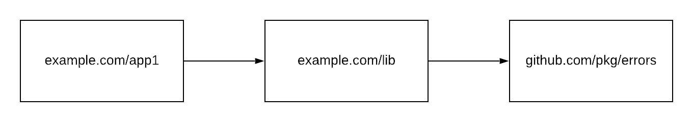
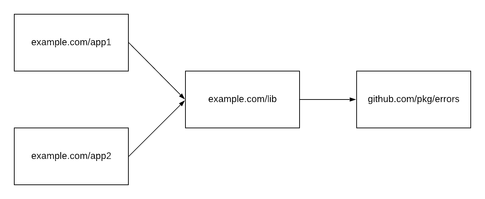
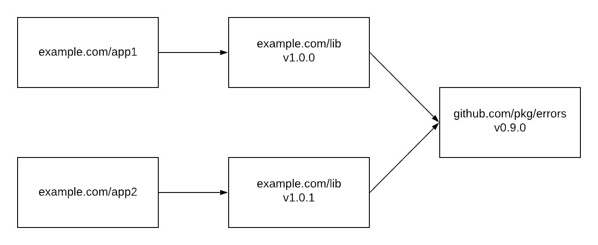
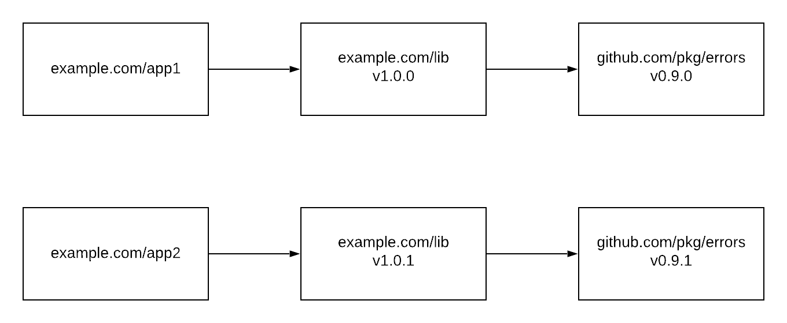
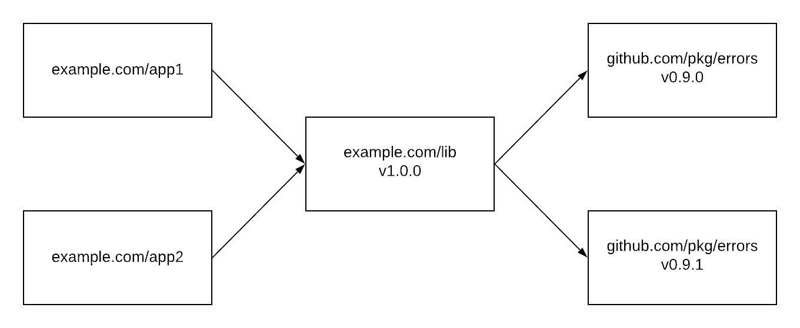

# Proposal: Multi-project gopls workspaces

Author(s): Heschi Kreinick, Rebecca Stambler

Last updated: [Date]

Discussion at https://golang.org/issue/37720.

## Abstract

We propose a new workspace model for gopls that supports editing multiple projects at the same time, without compromising editor features.

## Background

`gopls` users may want to edit multiple projects in one editor session.
For example, a microservice might depend on a proprietary infrastructure library, and a feature might require working across both.
In `GOPATH` mode, that's relatively trivial, because all code exists in the same context.
In module mode, where multiple versions of dependencies are in play, it is much more difficult.
Consider the following application:


If I `Find References` on an `errors.Wrapf` call in `app1`, I expect to see references in `lib` as well.
This is especially true if I happen to own `lib`, but even if not I may be looking for usage examples.
In this situation, supporting that is easy.

Now consider a workspace with two applications.



Again, I would expect a `Find References` in either App1 or App2 to find all `Wrapf` calls, and there's no reason that shouldn't work in this scenario.
In module mode, things can be more difficult. Here's the next step in complexity:



At the level of the type checker, `v1.0.0` and `v1.0.1` of the library are completely unrelated packages that happen to share a name.
We as humans expect the APIs to match, but they could be completely different.
Nonetheless, in this situation we can simply load both, and if we do a `Find References` on `Wrapf` there should be no problem finding all of them.
That goes away in the next step:



Now there are two versions of `Wrapf`.
Again, at the type-checking level, these packages have nothing to do with each other.
There is no easy way to relate `Wrapf` from `v0.9.1` with its match from `v0.9.0`.
We would have to do a great deal of work to correlate all the versions of a package together and match them up.
(Wrapf is a simple case; consider how we'd match them if it was a method receiver, or took a complex struct, or a type from another package.)
Worse yet, how would a multi-project rename work? Would it rename in all versions?

One final case:


Imagine I start in App1 and `Go To Definition` on a function from the utility library.
So far, no problem: there's only one version of the utility library in scope.
Now I `Go To Definition` on `Wrapf`.
Which version should I go to?
The answer depends on where I came from, but that information can't be expressed in the filesystem path of the source file, so there's no way for `gopls` to keep track.

## Proposal

We propose to require all projects in a multi-project workspace use the same set of dependency versions.
For `GOPATH`, this means that all the projects should have the same `GOPATH` setting.
For module mode, it means creating one super-module that forces all the projects to resolve their dependencies together.
Effectively, this would create an on-the-fly monorepo.
This rules out users working on projects with mutually conflicting requirements, but that will hopefully be rare.
Hopefully `gopls` can create this super-module automatically.

The super-module would look something like:

```
module gopls-workspace

require (
    example.com/app1 v0.0.0-00010101000000-000000000000
    example.com/app2 v0.0.0-00010101000000-000000000000
)

replace (
    example.com/app1 => /abs/path/to/app1
    example.com/app2 => /abs/path/to/app2

    // Further replace directives included from app1 and app2
)
```

Note the propagation of replace directives from the constituent projects, since they would otherwise not take effect.

## Rationale

For users to get the experience they expect, with all of the scenarios above working, the only possible model is one where there's one version of any dependency in scope at a time.
We don't think there are any realistic alternatives to this model.
We could try to include multiple versions of packages and then correlate them by name and signature (as discussed above) but that would be error-prone to implement.
And if there were any problems matching things up, features like `Find References` would silently fail.
## Compatibility

No compatibility issues.

## Implementation

The `gopls` dev team will do the necessary work as time permits.

## Open issues (if applicable)

The `go.mod` editing functionality of `gopls` should continue to work as it does today, even in multi-project mode.
Most likely it should simply continue to operate in one project at a time.
