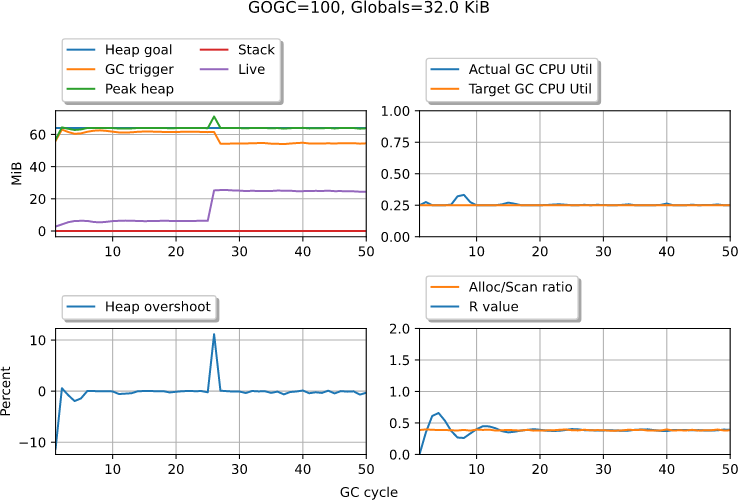
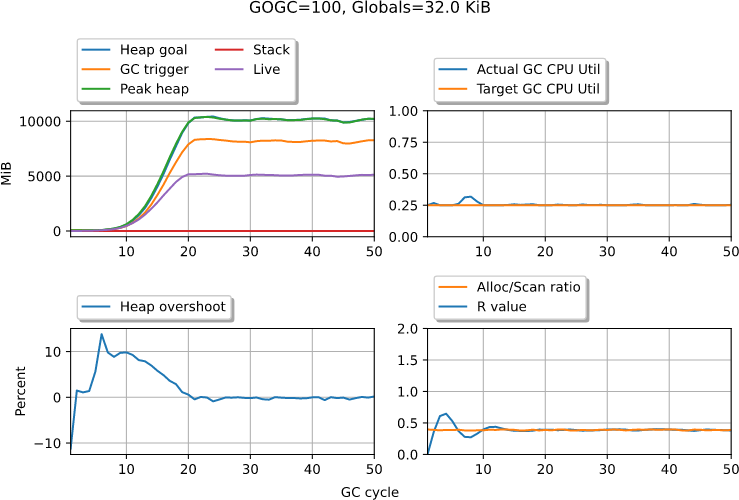
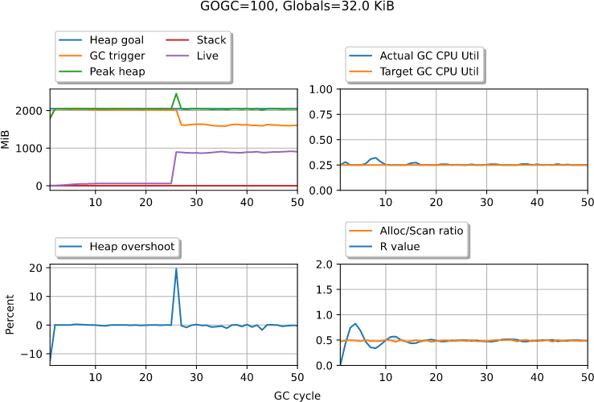
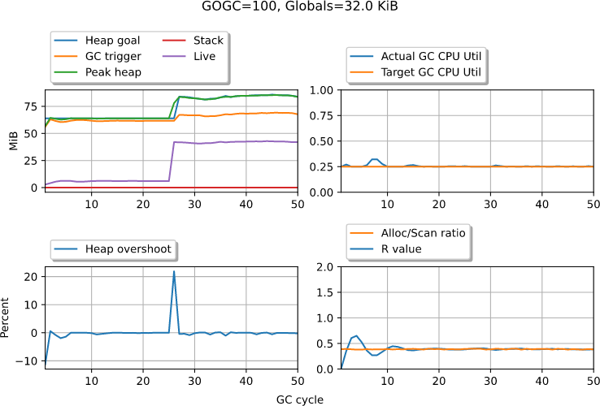
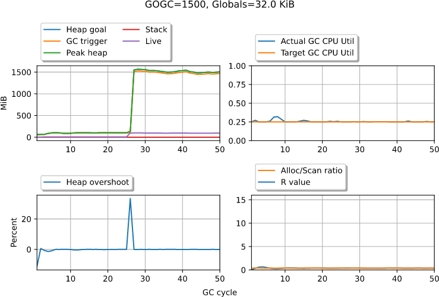
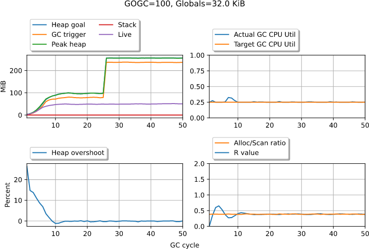
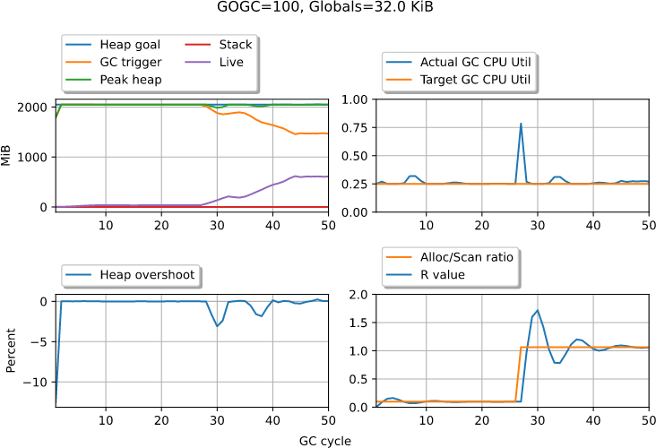

# User-configurable memory target

Author: Michael Knyszek

Updated: 16 February 2021

## Background

Issue [#23044](https://golang.org/issue/23044) proposed the addition of some
kind of API to provide a "minimum heap" size; that is, the minimum heap goal
that the GC would ever set.
The purpose of a minimum heap size, as explored in that proposal, is as a
performance optimization: by preventing the heap from shrinking, each GC cycle
will get longer as the live heap shrinks further beyond the minimum.

While `GOGC` already provides a way for Go users to trade off GC CPU time and
heap memory use, the argument against setting `GOGC` higher is that a live heap
spike is potentially dangerous, since the Go GC will use proportionally more
memory with a high proportional constant.
Instead, users (including a [high-profile account by
Twitch](https://blog.twitch.tv/en/2019/04/10/go-memory-ballast-how-i-learnt-to-stop-worrying-and-love-the-heap-26c2462549a2/)
have resorted to using a heap ballast: a large memory allocation that the Go GC
includes in its live heap size, but does not actually take up any resident
pages, according to the OS.
This technique thus effectively sets a minimum heap size in the runtime.
The main disadvantage of this technique is portability.
It relies on implementation-specific behavior, namely that the runtime will not
touch that new allocation, thereby preventing the OS from backing that space
with RAM on Unix-like systems.
It also relies on the Go GC never scanning that allocation.
This technique is also platform-specific, because on Windows such an allocation
would always count as committed.

Today, the Go GC already has a fixed minimum heap size of 4 MiB.
The reasons around this minimum heap size stem largely from a failure to account
for alternative GC work sources.
See [the GC pacer problems meta-issue](https://golang.org/issue/42430) for more
details.
The problems are resolved by a [proposed GC pacer
redesign](https://golang.org/issue/44167).

## Design

I propose the addition of the following API to the `runtime/debug` package:

```go
// SetMemoryTarget provides a hint to the runtime that it can use at least
// amount bytes of memory. amount is the sum total of in-ue Go-related memory
// that the Go runtime can measure.
//
// That explictly includes:
// - Space and fragmentation for goroutine stacks.
// - Space for runtime structures.
// - The size of the heap, with fragmentation.
// - Space for global variables (including dynamically-loaded plugins).
//
// And it explicitly excludes:
// - Read-only parts of the Go program, such as machine instructions.
// - Any non-Go memory present in the process, such as from C or another
//   language runtime.
// - Memory required to maintain OS kernel resources that this process has a
//   handle to.
// - Memory allocated via low-level functions in the syscall package, like Mmap.
//
// The intuition and goal with this definition is the ability to treat the Go
// part of any system as a black box: runtime overheads and fragmentation that
// are otherwise difficult to account for are explicitly included.
// Anything that is difficult or impossible for the runtime to measure portably
// is excluded. For these cases, the user is encouraged to monitor these
// sources for their particular system and update the memory target as
// necessary.
//
// The runtime is free to ignore the hint at any time.
//
// In practice, the runtime will use this hint to run the garbage collector
// less frequently by using up any additional memory up-front. Any memory used
// beyond that will obey the GOGC trade-off.
//
// If the GOGC mechanism is turned off, the hint is always ignored.
//
// Note that if the memory target is set higher than the amount of memory
// available on the system, the Go runtime may attempt to use all that memory,
// and trigger an out-of-memory condition.
//
// An amount of 0 will retract the hint. A negative amount will always be
// ignored.
//
// Returns the old memory target, or -1 if none was previously set.
func SetMemoryTarget(amount int) int
```

The design of this feature builds off of the [proposed GC pacer
redesign](https://golang.org/issue/44167).

I propose we move forward with almost exactly what issue
[#23044](https://golang.org/issue/23044) proposed, namely exposing the heap
minimum and making it configurable via a runtime API.
The behavior of `SetMemoryTarget` is thus analogous to the common (but
non-standard) Java runtime flag `-Xms` (with Adaptive Size Policy disabled).
With the GC pacer redesign, smooth behavior here should be straightforward to
ensure, as the troubles here basically boil down to the "high `GOGC`" issue
mentioned in that design.

There's one missing piece and that's how to turn the hint (which is memory use)
into a heap goal.
Because the heap goal includes both stacks and globals, I propose that we
compute the heap goal as follows:

```
Heap goal = amount
	// These are runtime overheads.
	- MemStats.GCSys
	- Memstats.MSpanSys
	- MemStats.MCacheSys
	- MemStats.BuckHashSys
	- MemStats.OtherSys
	- MemStats.StackSys
	// Fragmentation.
	- (MemStats.HeapSys-MemStats.HeapInuse)
	- (MemStats.StackInuse-(unused portions of stack spans))
```

What this formula leaves us with is a value that should include:
1. Stack space that is actually allocated for goroutine stacks,
1. Global variables (so the part of the binary mapped read-write), and
1. Heap space allocated for objects.
These are the three factors that go into determining the `GOGC`-based heap goal
according to the GC pacer redesign.

Note that while at first it might appear that this definition of the heap goal
will cause significant jitter in what the heap goal is actually set to, runtime
overheads and fragmentation tend to be remarkably stable over the lifetime of a
Go process.

In an ideal world, that would be it, but as the API documentation points out,
there are a number of sources of memory that are unaccounted for that deserve
more explanation.

Firstly, there's the read-only parts of the binary, like the instructions
themselves, but these parts' impact on memory use are murkier since the
operating system tends to de-duplicate this memory between processes.
Furthermore, on platforms like Linux, this memory is always evictable, down to
the last available page.
As a result, I intentionally ignore that factor here.
If the size of the binary is a factor, unfortunately it will be up to the user
to subtract out that size from the amount they pass to `SetMemoryTarget`.

The source of memory is anything non-Go, such as C code (or, say a Python VM)
running in the same process.
These sources also need to be accounted for by the user because this could be
absolutely anything, and portably interacting with the large number of different
possibilities is infeasible.
Luckily, `SetMemoryTarget` is a run-time API that can be made to respond to
changes in external memory sources that Go could not possibly be aware of, so
API recommends updating the target on-line if need be.

Another source of memory use is kernel memory.
If the Go process holds onto kernel resources that use memory within the kernel
itself, those are unaccounted for.
Unfortunately, while this API tries to avoid situations where the user needs to
make conservative estimates, this is one such case.
As far as I know, most systems do not associate kernel memory with a process, so
querying and reacting to this information is just impossible.

The final source of memory is memory that's created by the Go program, but that
the runtime isn't necessarily aware of, like explicitly `Mmap`'d memory.
Theoretically the Go runtime could be aware of this specific case, but this is
tricky to account for in general given the wide range of options that can be
passed to `mmap`-like functionality on various platforms.
Sometimes it's worth accounting for it, sometimes not.
I believe it's best to leave that up to the user.

To validate the design, I ran several [simulations](#simulations) of this
implementation.
In general, the runtime is resilient to a changing heap target (even one that
changes wildly) but shrinking the heap target significantly has the potential to
cause GC CPU utilization spikes.
This is by design: the runtime suddenly has much less runway than it thought
before the change, so it needs to make that up to reach its goal.

The only issue I found with this formulation is the potential for consistent
undershoot in the case where the heap size is very small, mostly because we
place a limit on how late a GC cycle can start.
I think this is OK, and I don't think we should alter our current setting.
This choice means that in extreme cases, there may be some missed performance.
But I don't think it's enough to justify the additional complexity.

### Simulations

These simulations were produced by the same tool as those for the [GC pacer
redesign](https://github.com/golang/go/issues/44167).
That is,
[github.com/mknyszek/pacer-model](https://github.com/mknyszek/pacer-model).
See the GC pacer design document for a list of caveats and assumptions, as well
as a description of each subplot, though the plots are mostly straightforward.

**Small heap target.**

In this scenario, we set a fairly small target (around 64 MiB) as a baseline.
This target is fairly close to what `GOGC` would have picked.
Mid-way through the scenario, the live heap grows a bit.



Notes:
- There's a small amount of overshoot when the live heap size changes, which is
  expected.
- The pacer is otherwise resilient to changes in the live heap size.

**Very small heap target.**

In this scenario, we set a fairly small target (around 64 MiB) as a baseline.
This target is much smaller than what `GOGC` would have picked, since the live
heap grows to around 5 GiB.



Notes:
- `GOGC` takes over very quickly.

**Large heap target.**

In this scenario, we set a fairly large target (around 2 GiB).
This target is fairly far from what `GOGC` would have picked.
Mid-way through the scenario, the live heap grows a lot.



Notes:
- There's a medium amount of overshoot when the live heap size changes, which is
  expected.
- The pacer is otherwise resilient to changes in the live heap size.

**Exceed heap target.**

In this scenario, we set a fairly small target (around 64 MiB) as a baseline.
This target is fairly close to what `GOGC` would have picked.
Mid-way through the scenario, the live heap grows enough such that we exit the
memory target regime and enter the `GOGC` regime.



Notes:
- There's a small amount of overshoot when the live heap size changes, which is
  expected.
- The pacer is otherwise resilient to changes in the live heap size.
- The pacer smoothly transitions between regimes.

**Exceed heap target with a high GOGC.**

In this scenario, we set a fairly small target (around 64 MiB) as a baseline.
This target is fairly close to what `GOGC` would have picked.
Mid-way through the scenario, the live heap grows enough such that we exit the
memory target regime and enter the `GOGC` regime.
The `GOGC` value is set very high.



Notes:
- There's a small amount of overshoot when the live heap size changes, which is
  expected.
- The pacer is otherwise resilient to changes in the live heap size.
- The pacer smoothly transitions between regimes.

**Change in heap target.**

In this scenario, the heap target is set mid-way through execution, to around
256 MiB.
This target is fairly far from what `GOGC` would have picked.
The live heap stays constant, meanwhile.



Notes:
- The pacer is otherwise resilient to changes in the heap target.
- There's no overshoot.

**Noisy heap target.**

In this scenario, the heap target is set once per GC and is somewhat noisy.
It swings at most 3% around 2 GiB.
This target is fairly far from what `GOGC` would have picked.
Mid-way through the live heap increases.


Notes:
- The pacer is otherwise resilient to a noisy heap target.
- There's expected overshoot when the live heap size changes.
- GC CPU utilization bounces around slightly.

**Very noisy heap target.**

In this scenario, the heap target is set once per GC and is very noisy.
It swings at most 50% around 2 GiB.
This target is fairly far from what `GOGC` would have picked.
Mid-way through the live heap increases.


Notes:
- The pacer is otherwise resilient to a noisy heap target.
- There's expected overshoot when the live heap size changes.
- GC CPU utilization bounces around, but not much.

**Large heap target with a change in allocation rate.**

In this scenario, we set a fairly large target (around 2 GiB).
This target is fairly far from what `GOGC` would have picked.
Mid-way through the simulation, the application begins to suddenly allocate much
more aggressively.



Notes:
- The pacer is otherwise resilient to changes in the live heap size.
- There's no overshoot.
- There's a spike in utilization that's consistent with other simulations of the
  GC pacer.
- The live heap grows due to floating garbage from the high allocation rate
  causing each GC cycle to start earlier.

### Interactions with other GC mechanisms

Although listed already in the API documentation, there are a few additional
details I want to consider.

#### GOGC

The design of the new pacer means that switching between the "memory target"
regime and the `GOGC` regime (the regimes being defined as the mechanism that
determines the heap goal) is very smooth.
While the live heap times `1+GOGC/100` is less than the heap goal set by the
memory target, we are in the memory target regime.
Otherwise, we are in the `GOGC` regime.
Notice that as `GOGC` rises to higher and higher values, the range of the memory
target regime shrinks.
At infinity, meaning `GOGC=off`, the memory target regime no longer exists.

Therefore, it's very clear to me that the memory target should be completely
ignored if `GOGC` is set to "off" or a negative value.

#### Memory limit

If we choose to also adopt an API for setting a memory limit in the runtime, it
would necessarily always need to override a memory target, though both could
plausibly be active simultaneously.
If that memory limit interacts with `GOGC` being set to "off," then the rule of
the memory target being ignored holds; the memory limit effectively acts like a
target in that circumstance.
If the two are set to an equal value, that behavior is virtually identical to
`GOGC` being set to "off" and *only* a memory limit being set.
Therefore, we need only check that these two cases behave identically.
Note however that otherwise that the memory target and the memory limit define
different regimes, so they're otherwise orthogonal.
While there's a fairly large gap between the two (relative to `GOGC`), the two
are easy to separate.
Where it gets tricky is when they're relatively close, and this case would need
to be tested extensively.

## Risks

The primary risk with this proposal is adding another "knob" to the garbage
collector, with `GOGC` famously being the only one.
Lots of language runtimes provide flags and options that alter the behavior of
the garbage collector, but when the number of flags gets large, maintaining
every possible configuration becomes a daunting, if not impossible task, because
the space of possible configurations explodes with each knob.

This risk is a strong reason to be judicious.
The bar for new knobs is high.

But there are a few good reasons why this might still be important.
The truth is, this API already exists, but is considered unsupported and is
otherwise unmaintained.
The API exists in the form of heap ballasts, a concept we can thank Hyrum's Law
for.
It's already possible for an application to "fool" the garbage collector into
thinking there's more live memory than there actually is.
The downside is resizing the ballast is never going to be nearly as reactive as
the garbage collector itself, because it is at the mercy of the of the runtime
managing the user application.
The simple fact is performance-sensitive Go users are going to write this code
anyway.
It is worth noting that unlike a memory maximum, for instance, a memory target
is purely an optimization.
On the whole, I suspect it's better for the Go ecosystem for there to be a
single solution to this problem in the standard library, rather than solutions
that *by construction* will never be as good.

And I believe we can mitigate some of the risks with "knob explosion."
The memory target, as defined above, has very carefully specified and limited
interactions with other (potential) GC knobs.
Going forward I believe a good criterion for the addition of new knobs should be
that a knob should only be added if it is *only* fully orthogonal with `GOGC`,
and nothing else.

## Monitoring

I propose adding a new metric to the `runtime/metrics` package to enable
monitoring of the memory target, since that is a new value that could change at
runtime.
I propose the metric name `/memory/config/target:bytes` for this purpose.
Otherwise, it could be useful for an operator to understand which regime the Go
application is operating in at any given time.
We currently expose the `/gc/heap/goal:bytes` metric which could theoretically
be used to determine this, but because of the dynamic nature of the heap goal in
this regime, it won't be clear which regime the application is in at-a-glance.

Therefore, I propose adding another metric `/memory/goal:bytes`.
This metric is analagous to `/gc/heap/goal:bytes` but is directly comparable
with `/memory/config/target:bytes` (that is, it includes additional overheads
beyond just what goes into the heap goal, it "converts back").
When this metric "bottoms out" at a flat line, that should serve as a clear
indicator that the pacer is in the "target" regime.
This same metric could be reused for a memory limit in the future, where it will
"top out" at the limit.

## Documentation

This API has an inherent complexity as it directly influences the behavior of
the Go garbage collector.
It also deals with memory accounting, a process that is infamously (and
unfortunately) difficult to wrap one's head around and get right.
Effective of use of this API will come down to having good documentation.

The documentation will have two target audiences: software developers, and
systems administrators (referred to as "developers" and "operators,"
respectively).

For both audiences, it's incredibly important to understand exactly what's
included and excluded in the memory target.
That is why it is explicitly broken down in the most visible possible place for
a developer: the documentation for the API itself.
For the operator, the `runtime/metrics` metric definition should either
duplicate this documentation, or point to the API.
This documentation is important for immediate use and understanding, but API
documentation is never going to be expressive enough.
I propose also introducing a new document to the `doc` directory in the Go
source tree that explains common use-cases, extreme scenarios, and what to
expect in monitoring in these various situations.
This document should include a list of known bugs and how they might appear in
monitoring.
In other words, it should include a more formal and living version of the [GC
pacer meta-issue](https://golang.org/issues/42430).
The hard truth is that memory accounting and GC behavior are always going to
fall short in some cases, and it's immensely useful to be honest and up-front
about those cases where they're known, while always striving to do better.
As every other document in this directory, it would be a living document that
will grow as new scenarios are discovered, bugs are fixed, and new functionality
is made available.

## Alternatives considered

Since this is a performance optimization, it's possible to do nothing.
But as I mentioned in [the risks section](#risks), I think there's a solid
justification for doing *something*.

Another alternative I considered was to provide better hooks into the runtime to
allow users to implement equivalent functionality themselves.
Today, we provide `debug.SetGCPercent` as well as access to a number of runtime
statistics.
Thanks to work done for the `runtime/metrics` package, that information is now
much more efficiently accessible.
By exposing just the right metric, one could imagine a background goroutine that
calls `debug.SetGCPercent` in response to polling for metrics.
The reason why I ended up discarding this alternative, however, is this then
forces the user writing the code that relies on the implementation details of
garbage collector.
For instance, a reasonable implementation of a memory target using the above
mechanism would be to make an adjustment each time the heap goal changes.
What if future GC implementations don't have a heap goal? Furthermore, the heap
goal needs to be sampled; what if GCs are occurring rapidly? Should the runtime
expose when a GC ends? What if the new GC design is fully incremental, and there
is no well-defined notion of "GC end"? It suffices to say that in order to keep
Go implementations open to new possibilities, we should avoid any behavior that
exposes implementation details.

## Go 1 backwards compatibility

This change only adds to the Go standard library's API surface, and is therefore
Go 1 backwards compatible.

## Implementation

Michael Knyszek will implement this.
1. Implement in the runtime.
1. Extend the pacer simulation test suite with this use-case in a variety of
   configurations.
