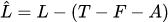
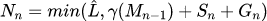

# Proposal: Soft memory limit

Author: Michael Knyszek

Date: 15 September 2021

## Summary

This document proposes a new option for tuning the behavior of the Go garbage
collector by setting a soft memory limit on the total amount of memory that Go
uses.

This option comes in two flavors: a new `runtime/debug` function called
`SetMemoryLimit` and a `GOMEMLIMIT` environment variable.

This new option gives applications better control over their resource economy.
It empowers users to:
* Better utilize the memory that they already have,
* Confidently decrease their memory limits, knowing Go will respect them,
* Avoid unsupported forms of garbage collection tuning like heap ballasts.

## Motivation

Go famously offers a single option for tuning the Go garbage collector: `GOGC`
(or `runtime/debug.SetGCPercent`).
This option offers a direct tradeoff between CPU and memory: it directly
dictates the amount of memory overhead available to the garbage collector.
Less memory overhead means more frequent garbage collection cycles, and more CPU
spent on GC.
More memory overhead means less frequent cycles and more CPU for the
application.

This option has carried the Go project well for a long time.
However, years of experience has produced a meaningful amount of evidence
suggesting that `GOGC` is not enough.
A direct tradeoff isn't always possible, because memory is not fungible relative
to CPU resources.

Consider an application that runs as a service or a daemon.
In these cases, out-of-memory errors often arise due to transient spikes in
applications' heap sizes.
Today, Go does not respect users' memory limits.
As a result, the Go community has developed various patterns for dealing with
out-of-memory errors.

In scenarios where out-of-memory errors are acceptable (to varying degrees), Go
users choose to live with these errors, restarting their service regularly,
instead of reducing `GOGC`.
Reducing `GOGC` directly impacts users' productivity metrics, metrics whose
behavior is largely governed by steady-state behavior, not transients, so this
course of action is undesirable.

In scenarios where out-of-memory errors are unacceptable, a similar situation
occurs.
Users are unwilling to increase GOGC to achieve productivity improvements, even
though in the steady-state they may actually have that memory available to them.
They pick an overly conservative value to reduce the chance of an out-of-memory
condition in transient states, but this choice leaves productivity on the table.

This out-of-memory avoidance led to the Go community developing its own
homegrown garbage collector tuning.

The first example of such tuning is the heap ballast.
In order to increase their productivity metrics while also avoiding
out-of-memory errors, users sometimes pick a low `GOGC` value, and fool the GC
into thinking that there's a fixed amount of memory live.
This solution elegantly scales with `GOGC`: as the real live heap increases, the
impact of that fixed set decreases, and `GOGC`'s contribution to the heap size
dominates.
In effect, `GOGC` is larger when the heap is smaller, and smaller (down to its
actual value) when the heap is larger.
Unfortunately, this solution is not portable across platforms, and is not
guaranteed to continue to work as the Go runtime changes.
Furthermore, users are forced to do complex calculations and estimate runtime
overheads in order to pick a heap ballast size that aligns with their memory
limits.

The second example of such tuning is calling `runtime/debug.FreeOSMemory` at
some regular interval, forcing a garbage collection to trigger sooner, usually
to respect some memory limit.
This case is much more dangerous, because calling it too frequently can lead a
process to entirely freeze up, spending all its time on garbage collection.
Working with it takes careful consideration and experimentation to be both
effective and avoid serious repercussions.

Both of these situations, dealing with out-of-memory errors and homegrown
garbage collection tuning, have a straightforward solution that other platforms
(like Java and TCMalloc) already provide its users: a configurable memory limit,
enforced by the Go runtime.
A memory limit would give the Go runtime the information it needs to both
respect users' memory limits, and allow them to optionally use that memory
always, to cut back the cost of garbage collection.

## Non-goals

1. Accounting for and react to memory outside the Go runtime, such as:

* Co-tenant processes in a container,
* C/C++ memory, and
* Kernel memory counted against the process.

Dealing with and reacting to memory used by other processes, and even to memory
within the process governed by the semantics of a completely different
programming language, is an incredibly hard problem and often requires a
coordinated effort.
It's outside of the scope of the Go runtime to solve this problem for everyone,
but I believe the Go runtime has an important role to play in supporting these
worthwhile efforts.

1. Eliminate out-of-memory errors in 100% of cases.

Whatever policy this API adheres to is going to fail for some use-case, and
that's OK.
The policy can be tweaked and improved upon as time goes on, but it's impossible
for us to create a solution that is all things to all people without a
tremendous amount of toil for our team (by e.g. exposing lots of tuning knobs).
On top of this, any such solution is likely to become difficult to use at all.
The best we can do is make life better for as many users as possible.

## Detailed design

The design of a memory soft limit consists of four parts: an API, mechanisms to
enforce the soft limit, and guidance through thorough documentation, and
telemetry for identifying issues in production.

### API

```go
package runtime/debug

// SetMemoryLimit provides the runtime with a soft memory limit.
//
// The runtime undertakes several processes to try to respect this
// memory limit, including adjustments to the frequency of garbage
// collections and returning memory to the underlying system more
// aggressively. This limit will be respected even if GOGC=off (or,
// if SetGCPercent(-1) is executed).
//
// The input limit is provided as bytes, and is intended to include
// all memory that the Go runtime has direct control over. In other
// words, runtime.MemStats.Sys - runtime.MemStats.HeapReleased.
//
// This limit does not account for memory external to Go, such as
// memory managed by the underlying system on behalf of the process,
// or memory managed by non-Go code inside the same process.
//
// A zero limit or a limit that's lower than the amount of memory
// used by the Go runtime may cause the garbage collector to run
// nearly continuously. However, the application may still make
// progress.
//
// See https://golang.org/doc/gc-ergonomics for a detailed guide
// explaining the soft memory limit as well as a variety of common
// use-cases and scenarios.
//
// SetMemoryLimit returns the previously set memory limit.
// By default, the limit is math.MaxInt64.
// A negative input does not adjust the limit, and allows for
// retrieval of the currently set memory limit.
func SetMemoryLimit(limit int64) int64
```

Note that the soft limit is expressed in terms of the total amount of memory
used by the Go runtime.
This choice means that enforcement of the soft memory limit by the GC must
account for additional memory use such as heap metadata and fragmentation.
It also means that the runtime is responsible for any idle heap memory above the
limit, i.e. any memory that is currently unused by the Go runtime, but has not
been returned to the operating system.
As a result, the Go runtime's memory scavenger must also participate in
enforcement.

This choice is a departure from similar APIs in other languages (including the
experimental `SetMaxHeap` [patch](https://golang.org/cl/46751)), whose limits
only include space occupied by heap objects themselves.
To reduce confusion and help facilitate understanding, each class of memory that
is accounted for will be precisely listed in the documentation.

In addition, the soft memory limit can be set directly via an environment
variable that all Go programs recognize: `GOMEMLIMIT`.

For ease-of-use, I propose `GOMEMLIMIT` accept either an integer value in bytes,
or a string such as "8GiB."
More specifically, an integer followed by one of several recognized unit
strings, without spaces.
I propose supporting "B," "KiB," "MiB," "GiB," and "TiB" indicating the
power-of-two versions of each.
Similarly, I propose supporting "KB," "MB," "GB," and "TB," which refer to their
power-of-ten counterparts.

### Enforcement

#### Garbage collection

In order to ensure the runtime maintains the soft memory limit, it needs to
trigger at a point such that the total heap memory used does not exceed the soft
limit.
Because the Go garbage collector's memory use is defined entirely in terms of
the heap goal, altering its definition is sufficient to ensure that a memory
limit is enforced.

However, the heap goal is defined in terms of object bytes, while the memory
limit includes a much broader variety of memory classes, necessitating a
conversion function between the two.

To compute the heap limit  from the soft memory
limit , I propose the following calculation:



 is the total amount of memory mapped by the Go runtime.
 is the amount of free and unscavenged memory the Go
runtime is holding.
 is the number of bytes in allocated heap objects at the
time  is computed.

The second term, , represents the sum of
non-heap overheads.
Free and unscavenged memory is specifically excluded because this is memory that
the runtime might use in the near future, and the scavenger is specifically
instructed to leave the memory up to the heap goal unscavenged.
Failing to exclude free and unscavenged memory could lead to a very poor
accounting of non-heap overheads.

With  fully defined, our heap goal for cycle
 () is a straightforward extension
of the existing one.

Where
*  is equal to bytes marked at the end of GC n's mark
  phase
*  is equal to stack bytes at the beginning of GC n's
  mark phase
*  is equal to bytes of globals at the beginning of GC
  n's mark phase
*  is equal to
  

then



Over the course of a GC cycle, non-heap overheads remain stable because the
mostly increase monotonically.
However, the GC needs to be responsive to any change in non-heap overheads.
Therefore, I propose a more heavy-weight recomputation of the heap goal every
time its needed, as opposed to computing it only once per cycle.
This also means the GC trigger point needs to be dynamically recomputable.
This check will create additional overheads, but they're likely to be low, as
the GC's internal statistics are updated only on slow paths.

The nice thing about this definition of  is that
it's fairly robust to changes to the Go GC, since total mapped memory, free and
unscavenged memory, and bytes allocated in objects, are fairly fundamental
properties (especially to any tracing GC design).

#### Death spirals

As the live heap grows toward , the Go garbage
collector is going to stray from the tradeoff defined by `GOGC`, and will
trigger more and more often to reach its goal.
Left unchecked, the Go garbage collector will eventually run continuously, and
increase its utilization as its runway disappears.
Eventually, the application will fail to make progress.
This process is referred to as a death spiral.

One way to deal with this situation is to place a limit on the amount of total
CPU utilization of the garbage collector.
If the garbage collector were to execute and exceed that limit at any point, it
will instead let the application proceed, even if that means missing its goal
and breaching the memory limit.

I propose we do exactly this, but rather than provide another knob for
determining the maximum fraction of CPU time, I believe that we should simply
pick a reasonable default based on `GOGC`.
I propose that we pick 50% as the default fraction.
This fraction is reasonable and conservative since most applications won't come
close to this threshold in normal execution.

To implement this policy, I propose a leaky bucket mechanism inspired by a tool
called `jvmquake` developed by [Netflix for killing Java service
instances](https://netflixtechblog.medium.com/introducing-jvmquake-ec944c60ba70)
that could fall into a death spiral.
To summarize, the mechanism consists of a conceptual bucket with a capacity, and
that bucket accumulates GC CPU time.
At the same time, the bucket is drained by mutator CPU time.
Should the ratio of GC CPU time to mutator CPU time exceed 1:1 for some time
(determined by the bucket's capacity) then the bucket's contents will tend
toward infinity.
At the point in which the bucket's contents exceed its capacity, `jvmquake`
would kill the target service instance.

In this case instead of killing the process, the garbage collector will
deliberately prevent user goroutines from assisting the garbage collector in
order to prevent the bucket from overflowing.
The purpose of the bucket is to allow brief spikes in GC CPU utilization.
Otherwise, anomalous situations could cause unnecessary missed assists that make
GC assist pacing less smooth.

A reasonable bucket capacity will have to be chosen empirically, as it should be
large enough to accommodate worst-case pause times but not too large such that a
100% GC CPU utilization spike could cause the program to become unresponsive for
more than about a second.
1 CPU-second per `GOMAXPROCS` seems like a reasonable place to start.

Unfortunately, 50% is not always a reasonable choice for small values of `GOGC`.
Consider an application running with `GOGC=10`: an overall 50% GC CPU
utilization limit for `GOGC=10` is likely going to be always active, leading to
significant overshoot.
This high utilization is due to the fact that the Go GC at `GOGC=10` will reach
the point at which it may no longer start a GC much sooner than, say `GOGC=100`.
At that point, the GC has no option but to increase utilization to meet its
goal.
Because it will then be capped at increasing utilization, the GC will have no
choice but to use more memory and overshoot.
As a result, this effectively creates a minimum `GOGC` value: below a certain
`GOGC`, the runtime will be effectively acting as if the `GOGC` value was
higher.
For now, I consider this acceptable.

#### Returning memory to the platform

In the context of maintaining a memory limit, it's critical that the Go runtime
return memory to the underlying platform as a part of that process.

Today, the Go runtime returns memory to the system with a background goroutine
called the scavenger, which paces itself to consume around 1% of 1 CPU.
This pacing is conservative, but necessarily so: the scavenger must synchronize
with any goroutine allocating pages of memory from the heap, so this pacing is
generally a slight underestimate as it fails to include synchronization
overheads from any concurrent allocating goroutines.
Currently, the scavenger's goal is to return free memory to the platform until
it reaches the heap goal, accounting for page-level fragmentation and a fixed
10% overhead to avoid paging costs.

In the context of a memory limit, I propose that the scavenger's goal becomes
that limit.
Then, the scavenger should pace itself more aggressively as the runtime's memory
use approaches the limit.
I propose it does so using a proportional-integral controller whose input is the
difference between the memory limit and the memory used by Go, and whose output
is the CPU utilization target of the background scavenger.
This will make the background scavenger more reliable.

However, the background scavenger likely won't return memory to the OS promptly
enough for the memory limit, so in addition, I propose having span allocations
eagerly return memory to the OS to stay under the limit.
The time a goroutine spends in this will also count toward the 50% GC CPU limit
described in the [Death spirals](#death-spirals) section.

#### Alternative approaches considered

##### Enforcement

The conversion function from the memory limit to the heap limit described in
this section is the result of an impedance mismatch between how the GC pacer
views memory and how the memory limit is defined (i.e. how the platform views
memory).
An alternative approach would be to resolve this impedance mismatch.

One way to do so would be to define the memory limit in terms of heap object
bytes.
As discussed in the [API section](#api) however, this makes for a poor user
experience.

Another way is to redefine the GC pacer's view of memory to include other memory
sources.
Let's focus on the most significant of these: fragmentation.
Suppose we redefined the heap goal and the garbage collector's pacing to be
based on the spans containing objects, rather than the objects themselves.
This definition is straightforward to implement: marked memory is defined as the
sum total of memory used spans containing marked objects, and the heap is
considered to grow each time a fresh span is allocated.

Unfortunately, this redefinition comes with two major caveats that make it very
risky.
The first is that the definition of the GC steady-state, upon which much of the
pacer's intuition is built, now also depends on the degree of fragmentation,
making it a less fragile state in practice.

The second is that most heaps will have an inflated size.
Consider a situation where we start with a very dense heap.
After some time, most of the objects die, but there's still at least one object
alive in each span that previously contained a live object.
With the redefinition, the overall heap will grow to the same size despite much
less memory being alive.
In contrast, the existing definition will cause the heap to grow only only to a
multiple of the actual live objects memory, and it's very unlikely that it will
go beyond the spans already in-use.

##### Returning memory to the platform

If returning memory to the OS eagerly becomes a significant performance issue, a
reasonable alternative could be to crank up the background scavenger's CPU usage
in response to growing memory pressure.
This needs more thought, but given that it would now be controlled by a
controller, its CPU usage will be more reliable, and this is an option we can
keep in mind.
One benefit of this option is that it may impact latency less prominently.

### Documentation

Alongside this new feature I plan to create a new document in the doc directory
of the Go repository entitled "Go GC Ergonomics."
The purpose of this document is four-fold:
* Provide Go users with a high-level, but accurate mental and visual model of
  how the Go GC and scavenger behave with varying GOGC and GOMEMLIMIT settings.
* Address common use-cases and provide advice, to promote good practice for each
  setting.
* Break down how Go accounts for memory in excruciating detail.
  Often memory-related documentation is frustratingly imprecise, making every
  user's job much more difficult.
* Describe how to identify and diagnose issues related to the GC through runtime
  metrics.

While Hyrum's Law guarantees that the API will be used in unexpected ways, at
least a central and complete living document will exist to help users better
understand what it is that their code is doing.

### Telemetry

Identifying issues with the garbage collector becomes even more important with
new ways to interact with it.
While the Go runtime already exposes metrics that could aid in identifying
issues, these metrics are insufficient to create a complete diagnosis,
especially in light of the new API.

To further assist users in diagnosing issues related to the API (be that misuse
or bugs in the implementation) and the garbage collector in general, I propose
the addition of three new metrics to the [runtime/metrics
package](https://pkg.go.dev/runtime/metrics):
* `/gc/throttles:events`: a monotonically increasing count of leaky bucket
  overflows.
    * Direct indicator of the application entering a death spiral with the soft
      memory limit enabled.
* `/gc/cycles-by-utilization:percent`: histogram of GC cycles by GC CPU
  utilization.
    * Replaces the very misleading runtime.MemStats.GCCPUFraction
* `/gc/scavenge/cycles-by-utilization:percent`: histogram of scavenger
  utilization.
    * Since the scavenging rate can now change, identifying possible issues
      there will be critical.

## Prior art

### Java

Nearly every Java garbage collector operates with a heap limit by default.
As a result, the heap limit is not a special mode of operation for memory
limits, but rather the status quo.

The limit is typically configured by passing the `-Xmx` flag to the Java runtime
executable.
Note that this is a heap limit, not a memory limit, and so only counts heap
objects.
The OpenJDK runtime operates with a default value of ¼ of available memory or 1
GiB, whichever is lesser.
Generally speaking, Java runtimes often only return memory to the OS when it
decides to shrink the heap space used; more recent implementations (e.g. G1) do
so more rarely, except when [the application is
idle](https://openjdk.java.net/jeps/346).

Some JVMs are "container aware" and read the memory limits of their containers
to stay under the limit.
This behavior is closer to what is proposed in this document, but I do not
believe the memory limit is directly configurable, like the one proposed here.

### SetMaxHeap

For nearly 4 years, the Go project has been trialing an experimental API in the
`runtime/debug` package called `SetMaxHeap`.
The API is available as a patch in Gerrit and has been used for some time within
Google.

The API proposed in this document builds on top of the work done on
`SetMaxHeap`.

Some notable details about `SetMaxHeap`:
* Its limit is defined solely in terms of heap object bytes, like Java.
* It does not alter the scavenging policy of the Go runtime at all.
* It accepts an extra channel argument that provides GC pressure notifications.
    * This channel is ignored in most uses I'm aware of.
    * One exception is where it is used to log GC behavior for telemetry.
* It attempts to limit death spirals by placing a minimum on the runway the GC
  has.
    * This minimum was set to 10%.

Lessons learned from `SetMaxHeap`:
* Backpressure notifications are unnecessarily complex for many use-cases.
* Figuring out a good heap limit is tricky and leads to conservative limits.
* Without a memory return policy, its usefulness for OOM avoidance is limited.

### TCMalloc

TCMalloc provides a `SetMemoryLimit` function to set a [soft memory
limit](https://github.com/google/tcmalloc/blob/cb5aa92545ded39f75115f3b2cc2ffd66a17d55b/tcmalloc/malloc_extension.h#L306).
Because dynamic memory allocation is provided in C and C++ as a library,
TCMalloc's `SetMemoryLimit` can only be aware of its own overheads, but notably
it does include all sources of fragmentation and metadata in its calculation.

Furthermore, it maintains a policy of eagerly returning memory to the platform
if an allocation would cause TCMalloc's memory use to exceed the specified
limit.

### Go 1 compatibility

This change adds an API to the Go project and does not alter existing ones.
Therefore, the proposed changes are Go 1 backwards compatible.
