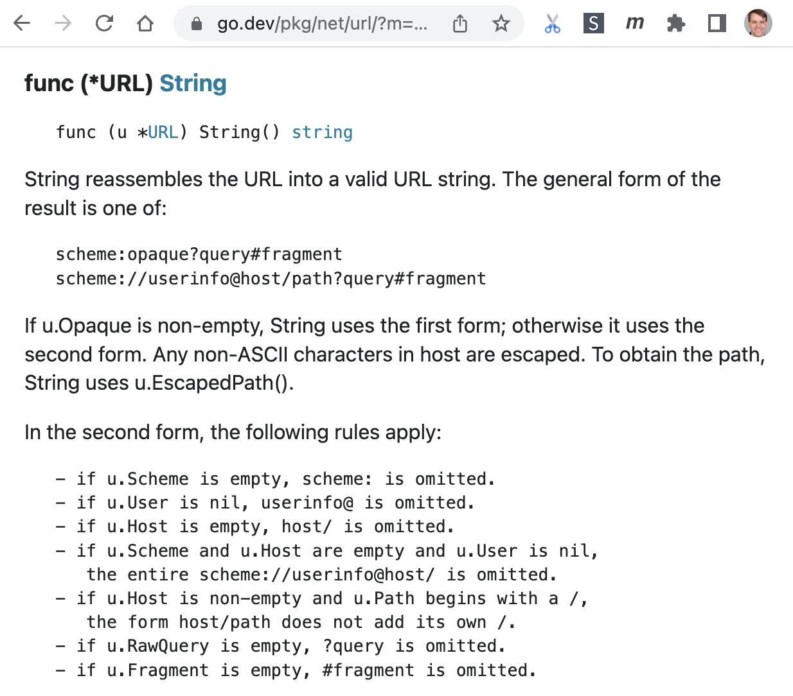
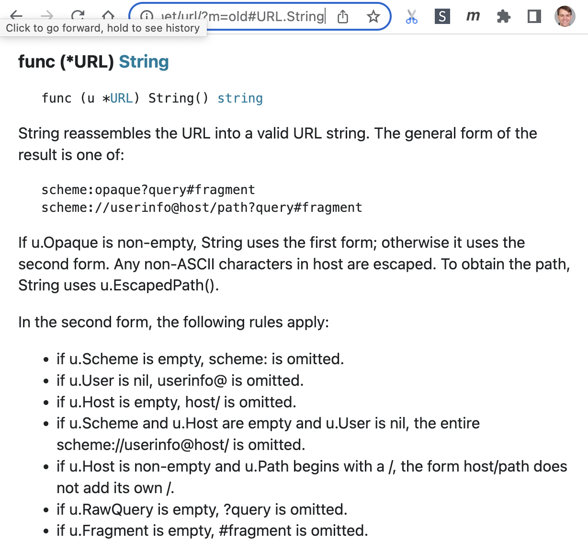
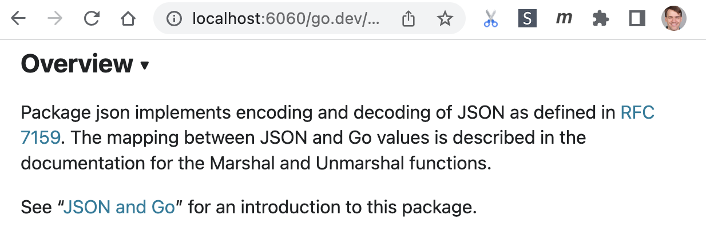
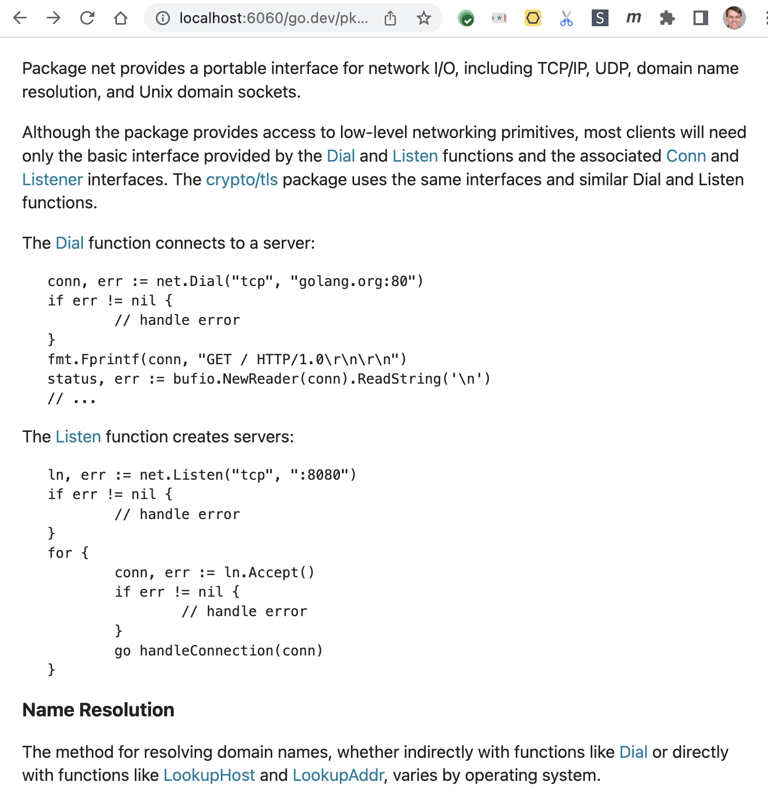

# Proposal: go/doc: headings, lists, and links in Go doc comments

Russ Cox \
January 2022

Earlier discussion at https://go.dev/issue/48305 and https://go.dev/issue/45533. \
Proposal at https://go.dev/issue/51082.

## Abstract

This proposal improves support for headings, lists, and links in Go doc comments,
while remaining backwards compatible with existing comments.
It includes a new package, `go/doc/comment`, exposing a parsed syntax tree for
doc comments, and it includes changes to `go/printer` and therefore `gofmt`
to format doc comments in a standard way.

<style>
th, td { vertical-align: top; }
</style>

For example, existing lists reformat from the display on the left to the one on the right:

<table>
<tr><td>
<td>
</table>

URL links can be rewritten to change the display on the left to the one on the right:

<table>
<tr><td>
<td>
</table>

And package doc comments (and others) can be rewritten to link to specific symbols:

<table>
<tr><td>
</table>

(Gerrit's Markdown viewer does not render the images.
See [the GitHub rendering](https://github.com/golang/proposal/blob/master/design/51082-godocfmt.md) instead.)

## Background

Go's doc comments today support plain text and preformatted (HTML \<pre>) blocks,
along with a subtle rule for turning certain lines into headings.
The specific rules are partially documented in the doc comment for [go/doc.ToHTML](https://pkg.go.dev/go/doc@go1.17#ToHTML):

> Each span of unindented non-blank lines is converted into a single paragraph. There is one exception to the rule: a span that consists of a single line, is followed by another paragraph span, begins with a capital letter, and contains no punctuation other than parentheses and commas is formatted as a heading.
>
> A span of indented lines is converted into a \<pre> block, with the common indent prefix removed.
>
> URLs in the comment text are converted into links; if the URL also appears in the words map, the link is taken from the map (if the corresponding map value is the empty string, the URL is not converted into a link).
>
> A pair of (consecutive) backticks (`) is converted to a unicode left quote (“), and a pair of (consecutive) single quotes (') is converted to a unicode right quote (”).
>
> Go identifiers that appear in the words map are italicized; if the corresponding map value is not the empty string, it is considered a URL and the word is converted into a link.

The current Go doc comment format has served us well since its
[introduction in 2009](https://go.googlesource.com/go/+/1605176e25fd).
There has only been one significant change, which was
[the addition of headings in 2011](https://go.googlesource.com/go/+/a6729b3085d7),
now clearly a bad design (see below).
But there are also a few long-open issues and proposals about doc comments, including:

- [#7349](https://go.dev/issue/7349) points out that the headings rule does not work well with non-Roman scripts.
- [#31739](https://go.dev/issue/31739) points out that lines ending with double quotes cannot be headings.
- [#34377](https://go.dev/issue/34377) points out that lines ending with parens cannot be headings.
- [#7873](https://go.dev/issue/7873) asks for list support.
- [#45533](https://go.dev/issue/45533) proposes linking of symbols, written as \[io.EOF], to make it easier to write good top-level doc comments and cross-reference with other packages.

It makes sense, as we approach a decade of experience, to take what we've learned and make one coherent revision, setting the syntax for the next 10 or so years.

### Goals and non-goals

The primary design criteria for Go doc comments was to make them
readable as ordinary comments when viewing the source code directly,
in contrast to systems like
[C#'s Xmldoc](https://docs.microsoft.com/en-us/dotnet/csharp/language-reference/xmldoc/examples),
[Java's Javadoc](https://www.oracle.com/technical-resources/articles/java/javadoc-tool.html), and
[Perl's Perlpod](https://perldoc.perl.org/perlpod).
The goal was to prioritize readability, avoiding syntactic ceremony and complexity.
This remains as a primary goal.

Another concern, new since 2009, is backwards compatibility.
Whatever changes we make, existing doc comments must generally continue to render well.
Less important, but still something to keep in mind, is forward compatibility:
keeping new doc comments rendering well in older Go versions, for a smoother transition.

Another goal for the revamp is that it include writing a separate, standalone web page
explaining how to write Go doc comments.
Today that information is
[squirreled away in the doc.ToHTML comment](https://pkg.go.dev/go/doc@go1.17#ToHTML) and is not easily found or widely known.

Within those constraints, the focus I have set for this revamp is to address the issues listed above.
Specifically:

  1. Make the header syntax more predictable. The headings rule is clearly difficult to remember and has too many false negatives. But further adjustments of the current rule run the risk of false positives.

  2. Add support for lists. There are many times in documentation when a bullet or numbered list is called for. Those appear in many doc comments today, as indented \<pre> blocks.

  3. Add support for links to URLs. Today the only way to link to something is by writing the URL directly, but those can sometimes be quite unreadable and interrupt the text.

  4. Add support for links to Go API documentation, in the current package and in other packages. This would have multiple benefits, but one is the ability in large packages to write top-level doc comments that give a good overview and link directly to the functions and types being described.

I believe it also makes sense to add another goal:

  5. Add formatting of doc comments to gofmt, to promote consistent appearance and create more room for future changes.

It is not a goal to support every possible kind of documentation or markup. For example:

 - Plain text has served us very well so far, and while some might prefer that _comments_ `allow` **font** ***`changes`***, the syntactic ceremony and complexity involved seems not worth the benefit, no matter how it is done.

 - People have asked for support for embedding images in documentation (see [#39513](https://github.com/golang/go/issues/39513)), but that adds significant complexity as well: image size hints, different resolutions, image sets, images suitable for both light and dark mode presentation, and so on. It is also difficult ([but not impossible](https://twitter.com/thingskatedid/status/1316074032379248640)) to render them on the command line. Although images clearly have important uses, all this complexity is in direct conflict with the primary goal. For these reasons, images are out of scope. I also note that C#'s Xmldoc and Perl's Perlpod seem not to have image support, although Java's Javadoc does.

Based on a [preliminary GitHub discussion](https://go.dev/issue/48305),
which in turn built on an [earlier discussion of doc links](https://go.dev/issue/45533),
this proposal aims to address headings, lists, and links.
The following subsections elaborate the background for each feature.

### Headings

As noted above, [headings were added in 2011](https://go.googlesource.com/go/+/a6729b3085d7),
and the current documentation says:

> a span that consists of a single line, is followed by another paragraph span, begins with a capital letter, and contains no punctuation other than parentheses and commas is formatted as a heading.

This is not quite accurate.
The code has been updated over time without maintaining the comment.
Today it includes a special case to allow “apostrophe s”
so “Go's doc comments” is a heading,
but “Go's heading rule doesn't work” is not a heading.
On the other hand, Unicode single right quotes are not rejected,
so “Go’s heading rule doesn’t work” is a heading.
On the other other hand, certain Unicode punctuation is rejected,
so that “The § symbol” is not a heading,
even though “The ¶ symbol” is a heading.
The rule also includes a special case for periods,
to permit “The go.dev site” but not “Best. Heading. Ever”.
The rule started out simple but insufficient,
and now the accumulated patches have made it a mess.

### Lists

There is no support for lists today. Documentation needing lists uses indented preformatted text instead.

For example, here are the docs for `cookiejar.PublicSuffixList`:

	// PublicSuffixList provides the public suffix of a domain. For example:
	//      - the public suffix of "example.com" is "com",
	//      - the public suffix of "foo1.foo2.foo3.co.uk" is "co.uk", and
	//      - the public suffix of "bar.pvt.k12.ma.us" is "pvt.k12.ma.us".
	//
	// Implementations of PublicSuffixList must be safe for concurrent use by
	// multiple goroutines.

And here are the docs for url.URL.String:

	// In the second form, the following rules apply:
	//      - if u.Scheme is empty, scheme: is omitted.
	//      - if u.User is nil, userinfo@ is omitted.
	//      - if u.Host is empty, host/ is omitted.
	//      - if u.Scheme and u.Host are empty and u.User is nil,
	//         the entire scheme://userinfo@host/ is omitted.
	//      - if u.Host is non-empty and u.Path begins with a /,
	//         the form host/path does not add its own /.
	//      - if u.RawQuery is empty, ?query is omitted.
	//      - if u.Fragment is empty, #fragment is omitted.

Ideally, we'd like to adopt a rule that makes these into bullet lists without any edits at all.

### Links

Documentation is more useful with clear links to other web pages.
For example, the encoding/json package doc today says:

	// Package json implements encoding and decoding of JSON as defined in
	// RFC 7159. The mapping between JSON and Go values is described
	// in the documentation for the Marshal and Unmarshal functions.
	//
	// See "JSON and Go" for an introduction to this package:
	// https://golang.org/doc/articles/json_and_go.html

There is no link to the actual RFC 7159, leaving the reader to Google it.
And the link to the “JSON and Go” article must be copied and pasted.

Documentation is also more useful with clear links to other documentation,
whether it's one function linking to another,
preferred version or a top-level doc comment summarizing the overall API of the package,
with links to the key types and functions.
Today there is no way to do this.
Names can be mentioned, of course, but users must find the docs on their own.

## Proposal

This proposal has nine parts:

1. New syntax for headings.
2. New syntax for lists.
3. New syntax for URL links
4. New syntax for documentation links.
5. Reformatting of doc comments by go/printer and gofmt.
6. New documentation for doc comments.
7. Rendering the new syntax on go.dev and pkg.go.dev.
8. A new go/doc/comment package.
9. Changes in the go/doc package.

Note that the new syntax is inspired by and aims to be a subset of Markdown,
but it is not full Markdown. This is discussed in the Rationale section below.

### New syntax for headings

If a span of non-blank lines is a single line beginning with # followed by a space or tab and then additional text, then that line is a heading.

	# This is a heading

Here are some examples of variations that do not satisfy the rule and are therefore not headings:

	#This is not a heading, because there is no space.

	# This is not a heading,
	# because it is multiple lines.

	# This is not a heading,
	because it is also multiple lines.

	The next span is not a heading, because there is no additional text:

	#

	In the middle of a span of non-blank lines,
	# this is not a heading either.

The old heading rule will remain valid, which is acceptable since it mainly
has false negatives, not false positives. This will keep existing doc comments
rendering as they do today.

### New syntax for lists

In a span of lines all blank or indented by one or more spaces or tabs
(which would otherwise be a \<pre> block), if the first indented line
begins with a bullet list marker or a numbered list marker, then that
span of indented lines is a bullet list or numbered list. A bullet
list marker is a dash, star, or plus followed by a space or tab and
then text. In a bullet list, each line beginning with a bullet list
marker starts a new list item. A numbered list marker is a decimal
number followed by a period or right parenthesis, then a space or tab,
and then text. In a numbered list, each line beginning with a number
list marker starts a new list item. Item numbers are left as is, never
renumbered (unlike Markdown).

Using this rule, most doc comments with \<pre> bullet lists today will
instead be rendered as proper bullet lists.

Note that the rule means that a list item followed by a blank line
followed by additional indented text continues the list item
(regardless of comparative indentation level):

	// Text.
	//
	//  - A bullet.
	//
	//     Another paragraph of that first bullet.
	//
	// - A second bullet.

Note also that there are no code blocks inside list items—any indented
paragraph following a list item continues the list item, and the list
ends at the next unindented line—nor are there nested lists. This
avoids any the space-counting subtlety like in Markdown.

To re-emphasize, a critical property of this definition of lists is
that it makes existing doc comments written with pseudo-lists turn
into doc comments with real lists.

Markdown recognizes three different bullets: -, \*, and +. In the main
Go repo, the dash is dominant: in comments of the form `` `//[
\t]+[-+*] ` `` (grepping, so some of these may not be in doc
comments), 84% use -, 14% use \*, and 2% use +. In a now slightly
dated corpus of external Go code, the star is dominant: 37.6% -, 61.8%
\*, 0.7% +.

Markdown also recognizes two different numeric list item suffixes:
“1.” and “1)”. In the main Go repo, 66% of comments use “1.” (versus
34% for “1)”). In the external corpus, “1.” is again the dominant
choice, 81% to 19%.

We have two conflicting goals: handle existing comments well, and
avoid needless variation. To satisfy both, all three bullets and both
forms of numbers will be recognized, but gofmt (see below) will
rewrite them to a single canonical form: dash for bullets, and “N.”
for numbers. (Why dashes and not asterisks? Proper typesetting of
bullet lists sometimes does use dashes, but never uses asterisks, so
using dashes keeps the comments looking as typographically clean as
possible.)

### New syntax for URL links

A span of unindented non-blank lines defines link targets when each
line is of the form “[Text]: URL”. In other text, “[Text]” represents
a link to URL using the given text—in HTML, \<a href="URL">Text\</a>.

For example:

	// Package json implements encoding and decoding of JSON as defined in
	// [RFC 7159]. The mapping between JSON and Go values is described
	// in the documentation for the Marshal and Unmarshal functions.
	//
	// For an introduction to this package, see the article
	// “[JSON and Go].”
	//
	// [RFC 7159]: https://tools.ietf.org/html/rfc7159
	// [JSON and Go]: https://golang.org/doc/articles/json_and_go.html

Note that the link definitions can only be given in their own
“paragraph” (span of non-blank unindented lines), which can contain
more than one such definition, one per line. If there is no
corresponding URL declaration, then (except for doc links, described
in the next section) the text is not a hyperlink, and the square
brackets are preserved.

This format only minimally interrupts the flow of the actual text,
since the URLs are moved to a separate section. It also roughly
matches the Markdown [shortcut reference
link](https://spec.commonmark.org/0.30/#shortcut-reference-link)
format, without the optional title text.

### New syntax for documentation links

Doc links are links of the form “[Name1]” or “[Name1.Name2]” to refer
to exported identifiers in the current package, or “[pkg]”,
“[pkg.Name1]”, or “[pkg.Name1.Name2]” to refer to identifiers in other
packages. In the second form, “pkg” can be either a full import path
or the assumed package name of an existing import. The assumed package
name is either the identifier in a renamed import or else [the name
assumed by
goimports](https://cs.opensource.google/go/x/tools/+/refs/tags/v0.1.5:internal/imports/fix.go;l=1128;drc=076821bd2bbc30898f197ea7efb3a48cee295288).
(Goimports inserts renamings when that assumption is not correct, so
this rule should work for essentially all Go code.) A “pkg” is only
assumed to be a full import path if it starts with a domain name (a
path element with a dot) or is one of the packages from the standard
library (“[os]”, “[encoding/json]”, and so on). To avoid problems with
maps, generics, and array types, doc links must be both preceded and
followed by punctuation, spaces, tabs, or the start or end of a line.

For example, if the current package imports encoding/json, then “[json.Decoder]” can be written in place of “[encoding/json.Decoder]” to link to the docs for encoding/json's Decoder.

The implications and potential false positives of this implied URL link are [presented by Joe Tsai here](https://github.com/golang/go/issues/45533#issuecomment-819363364). In particular, the false positive rate appears to be low enough not to worry about.

To illustrate the need for the punctuation restriction, consider:

	// Constant folding computes the exact constant value ([constant.Value])
	// for every expression ([ast.Expr]) that is a compile-time constant.

versus

	// The Types field, a map[ast.Expr]TypeAndValue,
	// holds type-checking results for all AST expressions.

and

	// A SHA1 hash is a [Size]byte.

### Reformatting doc comments

We propose that gofmt and go/printer reformat doc comments to
a conventional presentation, updating old syntax to new syntax
and standardizing details such as the indentation used for preformatted
blocks, the exact spacing in lists, and so on.

The reformatting would canonicalize a doc comment so that it
renders exactly as before but uses standard layout. Specifically:

 - All paragraphs are separated by single blank lines.
 - Legacy headings are converted to “#” headings.
 - All preformatted blocks are indented by a single tab.
 - All preformatted blocks have a blank line before and after.
 - All list markers are written as “␠␠-␠“ (space space dash space) or “␠N.␠“ (space number dot space).
 - All list item continuation text, including additional paragraphs, is indented by four spaces.
 - Lists that themselves contain any blank lines are separated
   from the preceding paragraph or heading by a blank line.
 - All lists are followed by a blank line (except at the end of the doc comment).
 - If there is a blank line anywhere in a list, there are blank lines between all list elements.
 - All bullet list items use - as the bullet (\* and + are converted).
 - All numbered list items use the “N.” form (“N)” is converted).
 - The ASCII double-single-quote forms that have always been
   defined to render as “ and ” are replaced with those.
 - Link URL definitionss are moved to the bottom of the doc comment,
   in two different blank-line-separated groups:
   definitions used by the doc comment
   and definitions not used.
   Separating the second group makes it easy first to recognize
   that there are unused definitions and second to delete them.
 - Tool directive comments, such as `//go:build linux`, are
   moved to the end of the doc comment (after link URLs).

The exact details have been chosen to make as few changes as possible
in existing comments, while still converging on a standard formatting
that leaves room for potential future expansion.
Like the rest of gofmt's rules, the exact details matter less than
having a consistent format.

The formatter would not reflow paragraphs, so as not to prohibit use of the
[semantic linefeeds convention](https://rhodesmill.org/brandon/2012/one-sentence-per-line/).

This canonical formatting has the benefit for Markdown aficionados of
being compatible with the Markdown equivalents. The output would still
not be exactly Markdown, since various punctuation would not be (and
does not need to be) escaped, but the block structure Go doc comments
and Markdown have in common would be rendered as valid Markdown.

### New documentation

We propose to add a new page, go.dev/doc/comment, describing how to write doc comments,
and to link to it from the go/doc and go/doc/comment package docs
and other places.

### Rendering the new syntax

We then propose to update golang.org/x/website/cmd/golangorg,
which serves go.dev, as golang.org/x/pkgsite, which serves pkg.go.dev,
to use the new documentation renderer.

### A new go/doc/comment package

The current doc.ToHTML is given only the comment text
and therefore cannot implement import-based links to other identifiers.
Some new API is needed.

The discussion on #48305 identified that many tool builders need
access to a parsed comment's abstract syntax tree,
so we propose to add a new package, go/doc/comment,
that provides both parsing and printing of doc comments.
The existing APIs in go/doc will be preserved and reimplemented
to use this API, but new code would be expected to use the new
entry points.

The new API in go/doc/comment defines an AST for doc comments,
of which the new Doc type is the root.
It defines Parser and Printer structs to hold parser and printer configuration.
The Parser type has a Parse method, turning text into a Doc.
The Printer type has printing methods Comment, HTML, Markdown, and Text,
each taking a Doc and returning the Go doc comment, HTML, Markdown,
and plain text form of the comment.

The full API is listed in the Appendix B below.

(Markdown output is new but implements an [already-accepted
proposal](https://golang.org/issue/34875).)

### Changes in the go/doc package

The existing Synopsis, ToHTML, and ToText top-level functions will continue to work,
but they will not be able to recognize documentation links
and will be marked as deprecated, in favor of new API in the form
of methods on type Package.

The Package type will also add two methods, Parser and Printer:

	func (*Package) Parser() *comment.Parser
	func (*Package) Printer() *comment.Printer

These return a freshly allocated struct on each call, so that the caller can
customize the parser or printer as needed and then use it to parse
or print a doc comment. The Parser will be configured to recognize
the imported packages and top-level declarations of the given package.
The printer will be a standard Printer for now, but perhaps that would
change in the future, and having p.Printer is more convenient for users.

For example, code that currently uses doc.ToHTML(w, text, words) could change to using:

	parser := p.Parser().Parse(text)
	parser.Words = words
	w.Write(p.Printer().HTML(parser.Parse(text))

There will also be API for the common cases, directly on Package,
to ease migration from the old top-level functions.

The full API is is listed in Appendix A below.

## Rationale

Much of the rationale for the current approach is given above during its description.
The main alternatives would be leaving things as they are (do nothing)
and adopting Markdown.

Doing nothing would leave the problems we have today
as far as headings, lists, and links unsolved.
We could muddle on that way, but this proposal aims to
fix those without introducing unnecessary complexity
nor giving up the current readability of doc comments.

### Markdown is not the answer, but we can borrow good ideas

An obvious suggestion is to switch to Markdown; this is especially
obvious given the discussion being hosted on GitHub where all comments
are written in Markdown. I am fairly convinced Markdown is not the
answer, for a few reasons.

First, there is no single definition of Markdown, as [explained on the
CommonMark site](https://commonmark.org/#why). CommonMark is roughly
what is used on GitHub, Reddit, and Stack Overflow (although even
among those there [can be significant
variation](https://github.github.com/gfm/)). Even so, let's define
Markdown as CommonMark and continue.

Second, Markdown is not backwards compatible with existing doc
comments. Go doc comments require only a single space of indentation
to start a \<pre> block, while Markdown requires more. Also, it is
common for Go doc comments to use Go expressions like \`raw strings\`
or formulas like a\*x^2+b\*x+c. Markdown would instead interpret those
as syntactic markup and render as “`raw strings` or formulas like
a*x^2+b*x+c”. Existing comments would need to be revised to make them
Markdown-safe.

Third, despite frequent claims of readability by its proponents,
Markdown is simply not terribly readable in aggregate. The basics
of Markdown can be simple and punctuation-free, but once you get into
more advanced uses, there is a surfeit of notation which directly
works against the goal of being able to read (and write) program
comments in source files without special tooling. Markdown doc
comments would end up full of backquotes and underscores and stars,
along with backslashes to escape punctuation that would otherwise be
interpreted specially. (Here is my favorite recent example of a
[particularly subtle
issue](https://github.com/commonmark/commonmark-spec/issues/646).)
The claims of readability for Markdown are perhaps made in comparison to HTML,
which is certainly true, but Go aims for even more readability.

Fourth, Markdown is surprisingly complex. Markdown, befitting its Perl
roots, provides more than one way to do just about anything: \_i\_,
\*i\*, and \<em>i\</em>; Setext and ATX headings; indented code blocks
and fenced code blocks; three different ways to write a link; and so
on. There are subtle rules about exactly how many spaces of
indentation are required or allowed in different circumstances. All of
this harms not just readability but also comprehensibility,
learnability, and consistency. The ability to embed arbitrary HTML
adds even more complexity. Developers should be spending their time on
the code, not on arcane details of documentation formatting.

Of course, Markdown is widely used and therefore familiar to many
users. Even though it would be a serious mistake to adopt Markdown in
its entirety, it does make sense to look to Markdown for conventions
that users would already be familiar with, that we can tailor to Go's
needs. If you are a fan of Markdown, you can view this revision as
making Go adopt a (very limited) subset of Markdown. If not, you can
view it as Go adopting a couple extra conventions that can be defined
separately from any Markdown implementation or spec.

## Compatibility

There are no problems as far as the [compatibility guidelines](https://golang.org/doc/go1compat).
Only new API is being added.
Existing API is being updated to continue to work as much as possible.
The exception is that doc.ToHTML and doc.ToText cannot render doc links,
because they do not know what package the docs came from.
But all other rendering, including rendering of existing doc comments,
will continue to work.

It is also worth considering how the new doc comments
with render in older versions of Go, during the transition period
when some people still have old toolchains.
Because headings remain in a paragraph by themselves,
the worst that will happen is that an old toolchain will render
a paragraph beginning with a # instead of a heading.
Because lists remain indented, old toolchains will continue to
show them as preformatted blocks.
And old toolchains will show the raw syntax for links,
which is chosen to be fairly readable in that case.

## Implementation

The core of the proposal is implemented as pending CLs,
to help understand its effect on existing code.
(In fact, the formatting rules have been adjusted,
and API features like ForceBlankBefore exist,
precisely to limit the typical effect on existing code.)

 - [CL 384263](https://go.dev/cl/384263) implements the new go/doc/comment package.
 - [CL 384264](https://go.dev/cl/384264) makes the changes to go/printer.
 - [CL 384265](https://go.dev/cl/384265) makes the changes to go/doc.
 - [CL 384266](https://go.dev/cl/384266) updates cmd/doc to use the new API.
 - [CL 384268](https://go.dev/cl/384268) shows the effect of reformatting comments in the Go repo.
 - [CL 384274](https://go.dev/cl/384274) uses the new package in golang.org/x/website.

If accepted, any adjustments can be made fairly easily.
Russ Cox would take care of landing that work.

There would also be work required in x/pkgsite to use the new APIs and retire that repo's fork of go/doc.

## Appendix: go/doc API changes

Added:

```
func (p *Package) HTML(text string) []byte
    HTML returns formatted HTML for the doc comment text.

    To customize details of the HTML, use [Package.Printer] to obtain a
    [comment.Printer], and configure it before calling its HTML method.

func (p *Package) Markdown(text string) []byte
    Markdown returns formatted Markdown for the doc comment text.

    To customize details of the Markdown, use [Package.Printer] to obtain a
    [comment.Printer], and configure it before calling its Markdown method.

func (p *Package) Parser() *comment.Parser
    Parser returns a doc comment parser configured for parsing doc comments from
    package p. Each call returns a new parser, so that the caller may customize
    it before use.

func (p *Package) Printer() *comment.Printer
    Printer returns a doc comment printer configured for printing doc comments
    from package p. Each call returns a new printer, so that the caller may
    customize it before use.

func (p *Package) Synopsis(text string) string
    Synopsis returns a cleaned version of the first sentence in text.
    That sentence ends after the first period followed by space and not
    preceded by exactly one uppercase letter. The result string has no \n, \r,
    or \t characters and uses only single spaces between words. If text starts
    with any of the IllegalPrefixes, the result is the empty string.

func (p *Package) Text(text string) []byte
    Text returns formatted text for the doc comment text, wrapped to 80 Unicode
    code points and using tabs for code block indentation.

    To customize details of the formatting, use [Package.Printer] to obtain a
    [comment.Printer], and configure it before calling its Text method.
```

Deprecated:

```
func Synopsis(text string) string
    Synopsis returns a cleaned version of the first sentence in text.

    Deprecated: New programs should use [Package.Synopsis] instead, which
    handles links in text properly.

func ToHTML(w io.Writer, text string, words map[string]string)
    ToHTML converts comment text to formatted HTML.

    Deprecated: ToHTML cannot identify documentation links in the doc comment,
    because they depend on knowing what package the text came from, which is not
    included in this API.

    Given the *[doc.Package] p where text was found, ToHTML(w, text, nil) can be
    replaced by:

            w.Write(p.HTML(text))

    which is in turn shorthand for:

            w.Write(p.Printer().HTML(p.Parser().Parse(text)))

    If words may be non-nil, the longer replacement is:

            parser := p.Parser()
            parser.Words = words
            w.Write(p.Printer().HTML(parser.Parse(d)))

func ToText(w io.Writer, text string, prefix, codePrefix string, width int)
    ToText converts comment text to formatted text.

    Deprecated: ToText cannot identify documentation links in the doc comment,
    because they depend on knowing what package the text came from, which is not
    included in this API.

    Given the *[doc.Package] p where text was found, ToText(w, text, "", "\t",
    80) can be replaced by:

            w.Write(p.Text(text))

    In the general case, ToText(w, text, prefix, codePrefix, width) can be
    replaced by:

            d := p.Parser().Parse(text)
            pr := p.Printer()
            pr.TextPrefix = prefix
            pr.TextCodePrefix = codePrefix
            pr.TextWidth = width
            w.Write(pr.Text(d))

    See the documentation for [Package.Text] and [comment.Printer.Text] for more
    details.
```


## Appendix: go/doc/comment API

```
package comment // import "go/doc/comment"


FUNCTIONS

func DefaultLookupPackage(name string) (importPath string, ok bool)
    DefaultLookupPackage is the default package lookup function, used when
    [Parser].LookupPackage is nil. It recognizes names of the packages from the
    standard library with single-element import paths, such as math, which would
    otherwise be impossible to name.

    Note that the go/doc package provides a more sophisticated lookup based on
    the imports used in the current package.


TYPES

type Block interface {
	// Has unexported methods.
}
    A Block is block-level content in a doc comment, one of *[Code], *[Heading],
    *[List], or *[Paragraph].

type Code struct {
	// Text is the preformatted text, ending with a newline character.
	// It may be multiple lines, each of which ends with a newline character.
	// It is never empty, nor does it start or end with a blank line.
	Text string
}
    A Code is a preformatted code block.

type Doc struct {
	// Content is the sequence of content blocks in the comment.
	Content []Block

	// Links is the link definitions in the comment.
	Links []*LinkDef
}
    A Doc is a parsed Go doc comment.

type DocLink struct {
	Text []Text // text of link

	// ImportPath, Recv, and Name identify the Go package or symbol
	// that is the link target. The potential combinations of
	// non-empty fields are:
	//  - ImportPath: a link to another package
	//  - ImportPath, Name: a link to a const, func, type, or var in another package
	//  - ImportPath, Recv, Name: a link to a method in another package
	//  - Name: a link to a const, func, type, or var in this package
	//  - Recv, Name: a link to a method in this package
	ImportPath string // import path
	Recv       string // receiver type, without any pointer star, for methods
	Name       string // const, func, type, var, or method name
}
    A DocLink is a link to documentation for a Go package or symbol.

func (l *DocLink) DefaultURL(baseURL string) string
    DefaultURL constructs and returns the documentation URL for l, using baseURL
    as a prefix for links to other packages.

    The possible forms returned by DefaultURL are:

        - baseURL/ImportPath, for a link to another package
        - baseURL/ImportPath#Name, for a link to a const, func, type, or var in another package
        - baseURL/ImportPath#Recv.Name, for a link to a method in another package
        - #Name, for a link to a const, func, type, or var in this package
        - #Recv.Name, for a link to a method in this package

    If baseURL ends in a trailing slash, then DefaultURL inserts a slash between
    ImportPath and # in the anchored forms. For example, here are some baseURL
    values and URLs they can generate:

        "/pkg/" → "/pkg/math/#Sqrt"
        "/pkg"  → "/pkg/math#Sqrt"
        "/"     → "/math/#Sqrt"
        ""      → "/math#Sqrt"

type Heading struct {
	Text []Text // the heading text
}
    A Heading is a doc comment heading.

func (h *Heading) DefaultID() string
    DefaultID returns the default anchor ID for the heading h.

    The default anchor ID is constructed by dropping all characters except A-Z,
    a-z, 0-9, space, and tab, converting to lower case, splitting into
    space-or-tab-separated fields, and then rejoining the fields using hyphens.
    For example, if the heading text is “Everybody Says Don't”, the default ID
    is “everybody-says-dont”.

type Italic string
    An Italic is a string rendered as italicized text.

type Link struct {
	Auto bool   // is this an automatic (implicit) link of a literal URL?
	Text []Text // text of link
	URL  string // target URL of link
}
    A Link is a link to a specific URL.

type LinkDef struct {
	Text string // the link text
	URL  string // the link URL
	Used bool   // whether the comment uses the definition
}
    A LinkDef is a single link definition.

type List struct {
	// Items is the list items.
	Items []*ListItem

	// ForceBlankBefore indicates that the list must be
	// preceded by a blank line when reformatting the comment,
	// overriding the usual conditions. See the BlankBefore method.
	//
	// The comment parser sets ForceBlankBefore for any list
	// that is preceded by a blank line, to make sure
	// the blank line is preserved when printing.
	ForceBlankBefore bool

	// ForceBlankBetween indicates that list items must be
	// separated by blank lines when reformatting the comment,
	// overriding the usual conditions. See the BlankBetween method.
	//
	// The comment parser sets ForceBlankBetween for any list
	// that has a blank line between any two of its items, to make sure
	// the blank lines are preserved when printing.
	ForceBlankBetween bool
}
    A List is a numbered or bullet list. Lists are always non-empty: len(Items)
    > 0. In a numbered list, every Items[i].Number is a non-empty string. In a
    bullet list, every Items[i].Number is an empty string.

func (l *List) BlankBefore() bool
    BlankBefore reports whether a reformatting of the comment should include a
    blank line before the list. The default rule is the same as for
    [BlankBetween]: if the list item content contains any blank lines (meaning
    at least one item has multiple paragraphs) then the list itself must be
    preceded by a blank line. A preceding blank line can be forced by setting
    [List].ForceBlankBefore.

func (l *List) BlankBetween() bool
    BlankBetween reports whether a reformatting of the comment should include a
    blank line between each pair of list items. The default rule is that if the
    list item content contains any blank lines (meaning at least one item has
    multiple paragraphs) then list items must themselves be separated by blank
    lines. Blank line separators can be forced by setting
    [List].ForceBlankBetween.

type ListItem struct {
	// Number is a decimal string in a numbered list
	// or an empty string in a bullet list.
	Number string // "1", "2", ...; "" for bullet list

	// Content is the list content.
	// Currently, restrictions in the parser and printer
	// require every element of Content to be a *Paragraph.
	Content []Block // Content of this item.
}
    A ListItem is a single item in a numbered or bullet list.

type Paragraph struct {
	Text []Text
}
    A Paragraph is a paragraph of text.

type Parser struct {
	// Words is a map of Go identifier words that
	// should be italicized and potentially linked.
	// If Words[w] is the empty string, then the word w
	// is only italicized. Otherwise it is linked, using
	// Words[w] as the link target.
	// Words corresponds to the [go/doc.ToHTML] words parameter.
	Words map[string]string

	// LookupPackage resolves a package name to an import path.
	//
	// If LookupPackage(name) returns ok == true, then [name]
	// (or [name.Sym] or [name.Sym.Method])
	// is considered a documentation link to importPath's package docs.
	// It is valid to return "", true, in which case name is considered
	// to refer to the current package.
	//
	// If LookupPackage(name) returns ok == false,
	// then [name] (or [name.Sym] or [name.Sym.Method])
	// will not be considered a documentation link,
	// except in the case where name is the full (but single-element) import path
	// of a package in the standard library, such as in [math] or [io.Reader].
	// LookupPackage is still called for such names,
	// in order to permit references to imports of other packages
	// with the same package names.
	//
	// Setting LookupPackage to nil is equivalent to setting it to
	// a function that always returns "", false.
	LookupPackage func(name string) (importPath string, ok bool)

	// LookupSym reports whether a symbol name or method name
	// exists in the current package.
	//
	// If LookupSym("", "Name") returns true, then [Name]
	// is considered a documentation link for a const, func, type, or var.
	//
	// Similarly, if LookupSym("Recv", "Name") returns true,
	// then [Recv.Name] is considered a documentation link for
	// type Recv's method Name.
	//
	// Setting LookupSym to nil is equivalent to setting it to a function
	// that always returns false.
	LookupSym func(recv, name string) (ok bool)
}
    A Parser is a doc comment parser. The fields in the struct can be filled in
    before calling Parse in order to customize the details of the parsing
    process.

func (p *Parser) Parse(text string) *Doc
    Parse parses the doc comment text and returns the *Doc form. Comment markers
    (/* // and */) in the text must have already been removed.

type Plain string
    A Plain is a string rendered as plain text (not italicized).

type Printer struct {
	// HeadingLevel is the nesting level used for
	// HTML and Markdown headings.
	// If HeadingLevel is zero, it defaults to level 3,
	// meaning to use <h3> and ###.
	HeadingLevel int

	// HeadingID is a function that computes the heading ID
	// (anchor tag) to use for the heading h when generating
	// HTML and Markdown. If HeadingID returns an empty string,
	// then the heading ID is omitted.
	// If HeadingID is nil, h.DefaultID is used.
	HeadingID func(h *Heading) string

	// DocLinkURL is a function that computes the URL for the given DocLink.
	// If DocLinkURL is nil, then link.DefaultURL(p.DocLinkBaseURL) is used.
	DocLinkURL func(link *DocLink) string

	// DocLinkBaseURL is used when DocLinkURL is nil,
	// passed to [DocLink.DefaultURL] to construct a DocLink's URL.
	// See that method's documentation for details.
	DocLinkBaseURL string
}
    A Printer is a doc comment printer. The fields in the struct can be filled
    in before calling any of the printing methods in order to customize the
    details of the printing process.

func (p *Printer) Comment(d *Doc) []byte
    Comment returns the standard Go formatting of the Doc, without any comment
    markers.

func (p *Printer) HTML(d *Doc) []byte
    HTML returns an HTML formatting of the Doc. See the [Printer] documentation
    for ways to customize the HTML output.

func (p *Printer) Markdown(d *Doc) []byte
    Markdown returns a Markdown formatting of the Doc. See the [Printer]
    documentation for ways to customize the Markdown output.

func (p *Printer) Text(d *Doc) []byte
    Text returns a textual formatting of the Doc. See the [Printer]
    documentation for ways to customize the text output.

type Text interface {
	// Has unexported methods.
}
    A Text is text-level content in a doc comment, one of [Plain], [Italic],
    *[Link], or *[DocLink].
```
