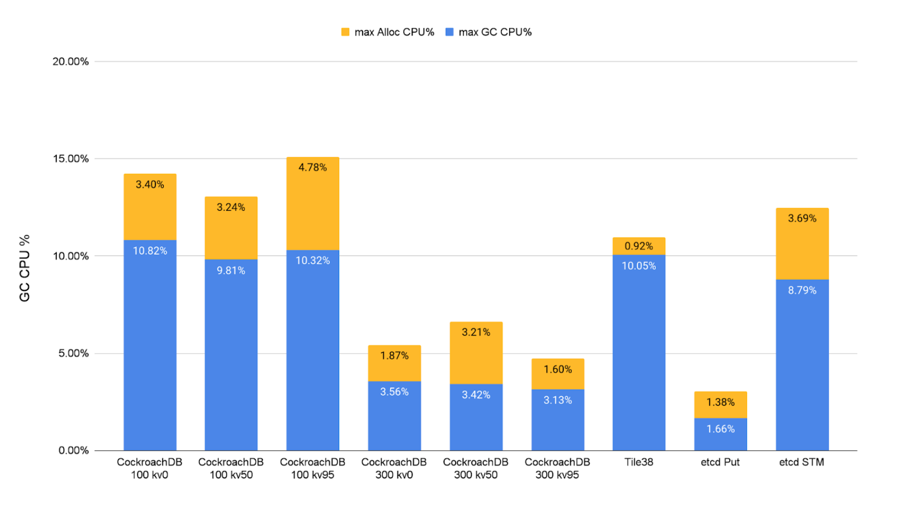
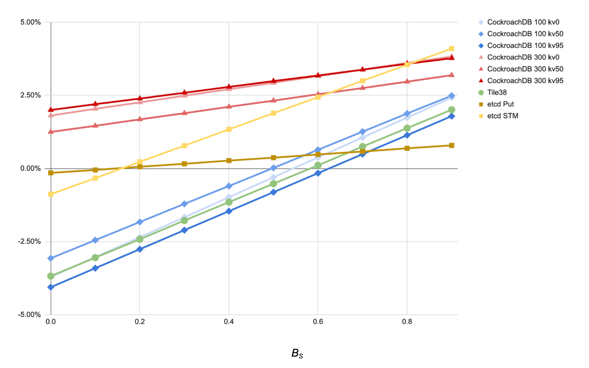

# Memory regions

## Background

The [arena experiment](https://github.com/golang/go/issues/51317) adds a package
consisting of a single type to the standard library: `Arena`.
This type allows one to allocate data structures into it directly, and allows
early release of the arena memory in bulk.
In other words, it offers a form of region-based memory management to Go.
The implementation is memory-safe insofar as use-after-frees will never result
in memory corruption, only a potential crash.

In practice, this package has improved real application performance by 10-15%,
achieved almost entirely due to earlier memory reuse and staving off GC
execution.

The proposal to add arenas to the standard library is on indefinite hold due to
concerns about API pollution.
Specifically, for the API to be useful in a wide range of circumstances, APIs
have to accept an additional arena parameter.
A good example of this problem is the standard library: many functions in the
standard library allocate heap memory, and could allocate memory into an arena
upon request instead.
But this would require changing so many APIs that it becomes infeasible, and is
not worth a 10-15% cost reduction.

Furthermore, arenas do not compose well with the existing language.
One example is stack allocation.
The Go compiler employs an escape analysis pass to stack-allocate memory when
possible.
This decouples that memory's lifecycle from the garbage collector entirely, and
is even more effective than arenas when it is possible.
Unfortunately, when one chooses to allocate into an arena, that _forces_ that
allocation to come from an arena.

This document proposes a composable replacement for arenas in the form of
user-defined goroutine-local memory regions.

## Goals

First and foremost, our main goal is to reduce resource costs associated with
the GC.
If we can't achieve that, then this proposal is pointless.

The second most important goal is composability.
Specifically:

- No requirement to change APIs to take advantage of arenas.
- Composability with standard library features, like `sync.Pool` and
`unique.Handle`.
- Composability with existing optimizations, like stack allocation via escape
analysis.

Finally, whatever we implement must be relatively easy to use and intuitive to
intermediate-to-advanced Go developers.
We must offer tools for discovering where regions might be worth it, and where
they aren't working out.

## Design

The core of this design revolves around a pair of functions that behave like
annotations of function calls.

The annotations indicate whether the user expects most or all the memory
allocated by some function call (and its callees) to stay local to that function
(and its callees), and to be unreachable by the time that function returns.
If these expectations hold, then that memory is eagerly reclaimed when the
function returns.

```go
package region

// Do creates a new scope called a region, and calls f in
// that scope. The scope is destroyed when Do returns.
//
// At the implementation's discretion, memory allocated by f
// and its callees may be implicitly bound to the region.
//
// Memory is automatically unbound from the region when it
// becomes reachable from another region, another goroutine,
// the caller of Do, its caller, or from any other memory not
// bound to this region.
//
// Any memory still bound to the region when it is destroyed is
// eagerly reclaimed by the runtime.
//
// This function exists to reduce resource costs by more
// effectively reusing memory, reducing pressure on the garbage
// collector.
// However, when used incorrectly, it may instead increase
// resource costs, as there is a cost to unbinding memory from
// the region.
// Always experiment and benchmark before committing to
// using a region.
//
// If Do is called within an active region, it creates a new one,
// and the old one is reinstated once f returns.
// However, memory cannot be rebound between regions.
// If memory created by an inner region is referenced by an outer
// region, it is not rebound to the outer region, but rather unbound
// completely.
// Memory created by an outer regions referenced by an inner region
// does not unbind anything, because the outer region always out-lives
// the inner region.
//
// Regions are local to the goroutines that create them,
// and do not propagate to newly created goroutines.
//
// Panics and calls to [runtime.Goexit] will destroy region
// scopes the same as if f returned, if they unwind past the
// call to Do.
func Do(f func())

// Ignore causes g and its callees to ignore the current
// region on the goroutine.
//
// Calling Ignore when not in an active region has no effect.
//
// The primary use-case for Ignore is to exclude memory that
// is known to out-live a region, to more effectively make use
// of regions. Using Ignore is less expensive than the unbinding
// process described in the documentation for [region.Do].
func Ignore(g func())
```

### Comparison with arenas

Where an arena might be used like:

```go
func myFunc(buf []byte) error {
	a := arena.New()
	defer a.Free()

	data := new(MyBigComplexProto)
	if err := proto.UnmarshalOptions{Arena: a}.Unmarshal(buf, data); err != nil {
		return err
	}
	// Do stuff with data. ...
}
```

Regions would be used like:

```go
func myFunc(buf []byte) error {
	var topLevelErr error
	region.Do(func() {
		data := new(MyBigComplexProto)
		if err := proto.Unmarshal(buf, data); err != nil {
			topLevelErr = err
			return
		}
		// Do stuff with data. ...
	})
	return topLevelErr
}
```

You can think of a region as an implicit goroutine-local arena that lives for
the duration of some function call.
That goroutine-local arena is then used for allocating _all_ the memory needed
by that function call and its callees (including maps, slices, structs, etc.).
And then thanks to some compiler and runtime magic, if any of that memory would
cause a use-after-free issue, it is automatically removed from the arena and
handed off to the garbage collector instead.

In practice, all uses of an arena within Google tightly limit the arena's
lifetime to that of a particular function, usually the one they are created in,
like the example above.
This fact suggests that regions will most likely be usable in most or all of the
same circumstances as arenas.

### Annotated examples

Below are some specific examples of different behaviors described in the API.

#### Basic

This example demonstrates that all major builtins are intended to work with this
functionality, and that leaking a pointer out of the region causes the memory it
points to to be unbound from the region.

```go
var keep *int
region.Do(func() {
	w := new(int)
	x := new(MyStruct)
	y := make([]int, 10)
	z := make(map[string]string)
	*w = use(x, y, z)
	keep = w // w is unbound from the region.
}) // x, y, and z's memory is eagerly cleaned up, w is not.
```

#### Nested regions

This example demonstrates how nested regions interact.

```go
region.Do(func() {
	z := new(MyStruct)
	var y *MyStruct
	region.Do(func() {
		x := new(MyStruct)
		use(x, z) // z may be freely used within this inner region.
		y = x // x is unbound from any region.
	})
	use(y)
})
```

## Implementation

### Overview

First, `region.Do` sets a field in the current `g` indicating the stack offset
at which the region begins.

If this stack offset field is `!= 0, runtime.mallocgc` uses a special allocation
path.
The non-zero stack offset field also implicitly enables a new kind of write
barrier for the goroutine (and only for that goroutine).

Then, `region.Do` calls the function that was passed to it.

The special allocation path allocates all memory in a special part of the heap.
Memory allocated this way is referred to as "**blue**" (**Bounded-Lifetime
Unshared** memory, **Eagerly** reclaimed, for fellow lovers of tortured
acronyms).
(Subtlety: "blueness" is relative to the goroutine that allocated the memory.)

In the `g`, we keep track of every span that was created as part of the blue
allocation path.
These spans are associated with the last call to `region.Do`.

The new write barrier catches writes of blue memory pointers to non-blue memory
(including regular heap memory, globals, other goroutine stacks, any part of the
stack above the latest `region.Do`, and cross-region writes (for nested regions,
since all cross-goroutine writes must pass through already-faded memory)) and
transitively "**fades**" the object graph rooted at the pointer being written.
Faded memory is managed by the GC in the traditional tri-color mark scheme
(hence "fading" to grayscale).

Once the function passed to `region.Do` returns, `region.Do` immediately sweeps
all the spans associated with it, releasing any blue memory and places the spans
back on a free list.

We go into more detail in the following sections.

### New g flag

Let's first define the behavior and invariants of a new field on the `g,
region`.
This value is not inherited when new goroutines are created, and it is not
inherited by `g0`.
This flag is only ever mutated and accessed by a goroutine, for itself.

### Blue memory management

If `runtime.mallocgc` sees that the current goroutine's `region` value is
non-zero, it goes down a special allocation path for blue memory.
This special allocation path allocates all memory in a part of the address space
that is separate (that may, but ideally won't, interleave with) the general
heap.

#### Address space

Region memory is allocated from dedicated `heapArenas` (not to be confused with
arenas, these are 64 MiB aligned reservations on most 64-bit platforms, or 4 MiB
on 32-bit platforms and Windows).
When these are created, we provide hints to `mmap` and the like to be contiguous
and in a distinct part of the address space from the heap, though it's OK if
these special region `heapArenas` interleave with regular `heapArenas`.

These special `heapArenas` are distinguished by a compact bitmap
(`mheap_.isRegionArena`) covering the whole address space, with each bit
representing one `heapArena`.
This bitmap is incredibly compact: a 48-bit address space divided into 64 MiB
chunks results in a 512 KiB bitmap.
We can reserve the full 512 KiB up-front and map in parts as-needed.
64 bytes of this bitmap (or one cache line on most systems) is sufficient to
cover a contiguous 32 GiB of region memory.

#### Memory layout

All blue memory is managed in fixed-size blocks with size 8 KiB.
If any allocation exceeds 2 KiB in size, it is not allocated blue, and is
instead redirected to the general heap.
These blocks are just special kinds of spans, and are backed with an `mspan`
that is managed like all other spans today.

The layout of each block follows the Immix design.
That is, each block is divided into 128-byte lines and groups of contiguous
lines are bump-allocated into.
Every allocation made into one of these regions has an 8-byte object header,
including objects without pointers and small objects (<=8 bytes in size).
(Insight: if objects are short-lived and we're going to reuse their memory
quickly, then per-object overheads don't matter as much.)

Implementation note: we can adjust the block size up to accommodate larger
objects.
We can also potentially allow much larger objects to participate in regions by
creating an additional `pageAlloc` structure for region-allocated memory.
This document assumes the greatest impact will be from smaller objects (<2 KiB),
which account for most of the allocation volume in most programs.
However, should that assumption fail, we can generalize at the cost of some
additional complexity.

#### Allocation

Just like Immix, objects are bump-pointer-allocated into contiguous free lines.
Also like Immix, each goroutine carries two local blocks to allocate from.
One block may be non-empty (that is, have some non-free lines) and the other
will always start out completely empty.
The main block is always attempted first, but medium-sized objects that fail to
allocate into the main block will be allocated into the secondary block.

Blocks are usually allocated from a P-local free list, and failing that, a
global free list.
If a full GC has run recently, each goroutine will first try to sweep its own
already-active blocks.

### Garbage collection

Each blue block reserves the first two lines for a pair of bit-per-word 128-byte
bitmaps.
One indicates the start of each object, while the other indicates which words of
the block have faded (tracked by the [write barrier](#new-write-barrier)).
The bit corresponding to an object's allocation header is set upon allocation.
Lines also each get mark and alloc bits, but since they're small (64 bits each)
they'll go right in the `mspan` for the block.

Each object's allocation header reserves the two least significant bits (which
will always be zero otherwise) for mark bits.
Each GC cycle, the two bits swap purposes.
In GC cycle N, the Nth bit mod 2 is the bit for that cycle.
When an object is marked, the (N+1 mod 2)'th bit is simultaneously cleared.

The GC will scan blocks using the object start bitmap to find the start of the
object, and thus the object header.
It marks and scans all reachable objects in blocks, even those objects that are
still blue.
It also marks any lines containing marked objects.
When the GC marks an object whose fade bits are not set, it leaves the fade bits
alone.

#### Sweeping

There are two ways in which objects in region blocks may have their memory made
available for reuse.
The first is based on the mark bits, which we'll call "full sweeping" since it's
very close in semantics to the existing sweeper.
The second is based on the fade bits, which we'll call "eager sweeping."

Full sweeping of all blocks is performed each GC cycle.
Lines that have not been marked are made available for allocation by installing
the line mark bits as the line allocation bits.
Note that freeing both blue and non-blue objects is completely fine here: the
mark bits prove whether or not the object is reachable.
This first kind of sweeping is the one referenced in the
[allocation](#allocation) path.

Eager sweeping of region blocks is performed when the function passed to
`region.Do` returns.
Lines that do not overlap with any faded words, as indicated by the bitmap, are
made available for allocation.
Note that we may free blue objects that were marked.
This is mostly fine: if the object never faded, we can be certain that the
object is dead when `f` returns.
The only hazard is if the GC queues a pointer to blue memory that is later
freed.
If the GC goes to inspect the object later, it might be gone.
Even worse, there might not be an object starting at the same address anymore!

There are many ways to deal with this problem, but here are two.

1. Delay eager sweeping until after the mark phase completes.
   This is unfortunate, but easy to implement and safe.
1. Keep a generation counter on each blue block.
   If the GC enqueues a blue pointer, it also queues the generation counter from
   the block it lives in.
   Later, it checks the generation counter when looking up the block for the
   object again and if it doesn't match, it skips doing any additional work.
   This complicates scanning, but would allow for eager reclamation during the
   mark phase.

### New write barrier

A new write barrier tracks when pointers to objects are written outside the call
tree rooted at `f` and the blocks associated with `f`'s region.
In other words, it tracks writes of blue pointers to non-blue memory.
This write barrier is enabled only if the `region` field on the `g` is non-zero.
The write barrier executes on each pointer write that is not to the current
stack frame (same as the existing write barrier).

If the write barrier discovers a blue pointer being written to non-blue memory,
the fade bits for the words corresponding to the object's memory are set.
Then, the object's referents are transitively marked as faded.
Below is a sketch of the write barrier's fast path.

```go
func regionWriteBarrier(ptr, dst unsafe.Pointer) {
	region := getg().region
	if region == 0 {
		return
	}
	if ptr == nil {
		return
	}
	if dst >= getg().stack.lo && dst < getg().stack.lo+region {
		// The pointer is being written into the stack within the region.
		return
	}
	ptrBlock := findRegionBlock(ptr)
	if ptrBlock == nil {
		// Pointer doesn't belong to a region.
		return
	}
	dstBlock := findRegionBlock(dst)
	// If they belong to different regions and ptr's region doesn't
	// does not out-live dst's, we must fade ptr.
	if dstBlock != nil && ptrBlock.region > dstBlock.region {
		// Otherwise, for within-region writes, only fade on writes of blue
		// to faded memory.
		if !ptrBlock.isBlue(ptr) || dstBlock.isBlue(dst) {
			return
		}
	}
	fade(ptr)
}

func findRegionBlock(ptr unsafe.Pointer) *regionBlock {
	// Check if the pointer lies inside of a region arena.
	arenaIdx := uintptr(ptr)/heapArenaBytes
	if mheap_.isRegionArena[arenaIdx/8]&(uint8(1)<<(arenaIdx%8)) == 0 {
		return nil
	}
	// Find the base of the block, where the fade bitmap, among other things, lives.
	base := uintptr(ptr) &^ (8192-1)
	return (*regionBlock)(unsafe.Pointer(base)))
}

type regionBlock struct {
	faded    [128]byte
	objStart [128]byte
	region   uintptr
	lineFade uint64
}

func (b *regionBlock) isBlue(ptr unsafe.Pointer) bool {
	// Find the word index that ptr corresponds to in the block.
	word := (uintptr(ptr)-uintptr(unsafe.Pointer(b)))/8

	// Load, mask, and check the bit corresponding to the word.
	return b.faded[word/8] & (1<<(word%8)) == 0
}
```

`fade` performs the transitive fade bitmap marking.
Note that objects must be _immediately_ transitively faded (that is, we cannot
defer the operation), because then it would be possible to hide pointers to
those objects in another goroutine's stack, which is not protected by a write
barrier (and shouldn't be; it's too expensive).

### Comparison with the arenas

#### Implicit allocation instead of explicit allocation

Arenas require explicitly choosing what gets allocated into an arena.
On the one hand, this offers fine-grained control over memory, but on the other
hand, does not compose well with the language.
For example, it requires updating APIs to make the best use of the arena.
Standard library APIs that do not accept an arena would need to have a new
version to allocate memory into the arena.

One could imagine making arenas implicit and goroutine-bound.
But the issue with implicitly allocating memory into an arena is that it's far
less clear when it's safe to free the arena since some values may have been
allocated into the arena that code authors don't expect.

In contrast, the regions design implicitly allocates **all** eligible heap
memory into a kind of memory region, but avoids the issue of not knowing when to
free memory.
In essence, the new write barrier effectively pins memory that is not safe to
free, meaning the rest can be freed once the region ends.
The regions design also offers an opt-out mechanism (`region.Ignore`), restoring
fine-grained control over memory allocation where needed.

Furthermore, explicit allocation introduces some complications with existing
optimizations.
For example, the compiler's escape analysis may be able to deduce that some
value may be stack allocated, but this analysis immediately fails if the value
is allocated into an arena.
Special compiler support could make arena-allocated values candidates for stack
allocation, but that's likely to be complex.

#### Finer granularity of memory reuse

One property of the arena experiment is that arena chunks are very large (8 MiB)
to amortize the cost of syscalls to force faults on the memory.
This means that, naively, making good use of arenas would require sharing them
across multiple logical operations (for example, multiple HTTP requests in a
server).
In practice, the arena experiment works around this by only reusing
partially-filled arena chunks, filling them up further.
However, these partially-filled chunks still contribute to the live heap, even
if most of the memory inside of them is dead.

Meanwhile, region blocks are _three orders of magnitude_ smaller than arena
chunks.
This means that there's really no need to try to reuse partially-filled region
blocks.
As a result, the baseline live heap contribution of `region.Do` should be
substantially smaller.

#### Accidentally retaining unreachable memory is less of a hazard

Failing to free an arena, or allocating too much into an arena, may result in
running out of memory, since the lifetime of all allocations in the arena are
truly bound together.
Even if large amounts of arena memory are no longer reachable, the GC is unable
to free them because arenas have no mechanism for reclamation except on the
order of arena chunks.

The region design meanwhile includes region blocks in the regular GC cycle.
This means that if regions are specified in an overly-broad way (regions that
are too big or too long-lived), there's no more potential for running out of
memory than usual.
Plus, blue memory in the region is still immediately reclaimable and reusable,
even if it survives multiple GC cycles.

#### Write barrier

One downside of regions over arenas is the write barrier necessary to prevent
use-after-free issues.
This design rests on the write barrier being cheap enough to avoid overwhelming
savings from reduced GC pressure.

The good news is that I believe this design achieves this goal.
See the [preliminary evaluation](#preliminary-evaluation).
To summarize, an upper bound on the expected CPU overhead of the write barrier
is between 1.1%–4.5%.
For applications that apply a substantial amount of GC pressure (resulting in
upwards of 10% GC CPU costs), this overhead should be readily recouped.
This analysis also assumes that all goroutines are in a region all of the time,
so it is truly a worst case.
I suspect this overhead is similar to the overhead of remapping large regions of
memory for arenas, so it can be thought of as a safety feature that has a cost.

## Preliminary evaluation

### Hypotheses

- In specific circumstances, a large fraction of allocations remain
goroutine-local and their lifetimes are bound to some call tree (in the limit,
the lifetime of a goroutine).
- The CPU benefit of faster allocation, less frequent global GCs, and the cache
benefit of fast memory reuse greatly outweigh the cumulative costs of the write
barrier test and transitive fades.
- Performance-sensitive users will be able to identify good candidates for
regions that don't result in frequent transitive fades, possibly with some light
tooling (e.g. profiling).
- Immix-style allocation is likely to slightly increase the live heap size on
average due to increased risk of fragmentation.
Allocation headers are likely to increase heap memory overheads for small
objects.
However, peak memory usage may be lower if less memory is likely to be live at
any given time due to the eager reuse.
Less time spent during GC cycles also means less memory allocated black, which
may shrink the live heap as well.
- Bump pointer allocation is likely to reduce median latency.
Reduced GC load and thus less frequent GCs are likely to decrease tail latency.
The effect of fading will depend on the application: if fading is frequent, it's
likely to increase median latency and tail latency; if it's rare, it's likely to
increase tail latency.

### Strategy

Because this technique involves new API, there are unknowns that are not
possible to quantify or estimate directly, since they depend on adoption in
usage.
In the analysis below, we define these unknowns and leave them unknown, allowing
us to plug in some reasonable numbers and make some reasonable inferences for
the best, worst, and middling cases.

#### CPU effect

- _AB_ = Allocated bytes
- _AO_ = Allocated objects
- _NGC_ = Number of GC cycles
- _BR_ = Fraction of bytes allocated in any region
- _OR_ = Fraction of objects allocated in any region
- _BF_ = Fraction of bytes allocated in any region, but fade
- _OF_ = Fraction of objects allocated in any region, but fade
- _BS_ = Fraction of bytes allocated in any region that do not fade, but are scanned (_BF_ + _BS_ ≤ 1)
- _CR_ = Relative cost of mark/sweep of region objects (expected >1)
- _PF_ = Pointer density (per byte) of faded objects

_BS_ is defined a little strangely, but can be considered as a proxy for average
region lifetime.

If all regions survive for at least a full GC cycle (all region memory is
visible to the GC for scanning) then _BS_ is 1.
If all regions begin and end outside of a GC cycle (not realistic), then _BS_ is
0.
Good uses of regions will have a low non-zero _BS_ parameter.

#### RAM effect

For now, we avoid building a model for the RAM effect.

The competing factors are substantially harder to measure, but are unlikely to
be deal-breakers.
For instance, the Immix-style memory layout has a worse worst-case fragmentation
than our existing heap layout, but the average case is only a few percent
different: previous experiments (sorry, no results, [only the simulation
tool](https://github.com/mknyszek/goat)) on real application data showed up to
10% when not optimizing for allocation headers tiny objects, and ~3.5% after
optimizing allocation headers for tiny objects.

However, the effects of eager reuse on the live heap size can also be
substantial, as evidenced by performance improvements found with arenas.
The theory behind this memory improvement is that less live memory is visible to
the GC at any given time, especially via the allocate-black policy.

And lastly, because of `GOGC`, CPU benefits may generally be translated into
memory benefits as needed.

#### Latency effect

For now, we also avoid building a model for the latency effect.
Latency effects are even more contextually sensitive and harder to measure than
RAM effects.
Furthermore, in this design, the cost depends heavily on how deeply chained
faded memory turns out to be.
While I suspect that in practice this won't be much of an issue, especially with
good [diagnostics](#diagnostics), it's worth keeping an eye out on latency
metrics as the design and its evaluation progresses.

#### Experiments

To estimate the CPU effect, the following experiments will be performed:

1. Prototype the write barrier test in the compiler and compute a cost per
   pointer write.
1. Prototype the fade path and empirically derive a cost function.
1. Prototype the Immix bump-pointer allocator and empirically derive a cost
   function.
1. Prototype the region cleanup path and empirically derive a cost function.

These experiments will fill in quite a few of the gaps mentioned above, but
still leave the following parameters for CPU cost undefined: _BR, OR, BF, OF,
BS, CR, PF_.

_BR, OR, BF, OF_, and _BS_ all depend on how users make use of the API.
Ideally, users will be able to choose regions with a very low chance of objects
escaping, and we can just pick numbers that represent this best-case scenario.
In such a case, the win should be large and obvious.
For example:

- _BR_ > 0.5
- _OR_ > 0.9 (targets small objects)
- _BF_ ≈ 0.0
- _OF_ ≈ 0.0
- _BS_ < 0.1
- _CR_ < 1.05
- _PF_ can be anything, but at most 0.125 on 64-bit platforms.

But there still remains the question of whether users will actually be able to
do that.
We can get a reasonable idea of that by estimating the sensitivity that each
parameter has on overall CPU cost in different parts of the space.

Lastly, there's _CR.
CR_ is defined the way it is because algorithmically, what we propose here is
not so far off from the existing GC scan loop.
It's reasonable to expect that the scan loop cost will only be a constant factor
off at most (that is, _CR_).
Furthermore, actually estimating _CR_ is quite tricky, because it's difficult to
pull a scan loop out of context.
I propose just treating _CR_ as a parameter and apply the same sensitivity
analysis to it.

### Results

#### CPU effect experiments

##### Benchmarks

I collected data from 6 benchmarks in the Sweet benchmark suite where statistics
from real applications were needed:

* etcd Put
* etcd STM
* Tile38
* CockroachDB kv0 (single node)
* CockroachDB kv50 (single node)
* CockroachDB kv95 (single node)

The CockroachDB benchmark was run with `GOGC=300` (the default) and `GOGC=100`.
It turns out that at `GOGC=300`, the benchmark has a total GC overhead of about
3%, for which regions make no sense.
However, I adjusted `GOGC` down to see if the possible CPU savings from regions
could translate into memory savings instead: less memory used for the same GC
overhead.

##### Write barrier test time

I estimated the write barrier test time by implementing the worst-case [write
barrier fast
path](https://github.com/mknyszek/region-eval/blob/main/cpusim/esc.go#L129)
(region -> region write, two lookups required) in Go and [benchmarking
it](https://github.com/mknyszek/region-eval/blob/main/cpusim/esc_test.go#L205).
My estimate is ~5.2 ns per pointer write on average.

`wbTestTime ≈ 5.2 ns`

This result is from the fast path's worst case: a region-to-region write
(requiring metadata inspections for both `ptr` and `dst`) with poor spatial and
temporal locality (`ptr` and `dst` are shuffled across 1 GiB of contiguous
region memory).
The fast path is also implemented in Go, and can likely be further optimized
with an assembly-based implementation.

Using a non-nil pointer write frequency we can estimate an upper-bound on the
cost of the write barrier in terms of a % overhead.

I measured the non-nil heap pointer write frequency for 3 benchmarks.
First, I [replaced cgocheck2
mode](https://go-review.googlesource.com/c/go/+/595776) with a non-nil pointer
write counting mode (that also counted pointers in typed memory copies and the
like).
After measuring the pointer write counts for the benchmark, I re-ran the
benchmarks with pointer-counting turned off, and estimated the total CPU time
available to the benchmark.
Next, I divided the CPU time by the pointer write count for the benchmark to
obtain an average pointer write rate.
Lastly, I divided the conservative cost of the new write barrier by this rate to
determine an overhead.
This process produced the following results:

* etcd STM
  * Mean CPU time between pointer writes: 119 cpu-ns
  * Write barrier overhead: 4.37%
* etcd Put
  * Mean CPU time between pointer writes: 491 cpu-ns
  * Write barrier overhead: 1.06%
* Tile38
  * Mean CPU time between pointer writes: 265 cpu-ns
  * Write barrier overhead: 1.96%
* CockroachDB kv0
  * Mean CPU time between pointer writes: 116 cpu-ns
  * Write barrier overhead: 4.45%
* CockroachDB kv50
  * Mean CPU time between pointer writes: 120 cpu-ns
  * Write barrier overhead: 4.30%
* CockroachDB kv95
  * Mean CPU time between pointer writes: 117 cpu-ns
  * Write barrier overhead: 4.43%

I conclude that the expected CPU cost of the write barrier will be between
1.1–4.5% _as an upper-bound_, since this value is computed assuming the write
barrier is enabled globally.

##### `fadeCPU(o, p)`

I determined this cost function by creating [a simple out-of-tree
prototype](https://github.com/mknyszek/region-eval/blob/main/cpusim/esc_test.go#L20)
of the fade slow path.
The fade slow path has a per-object cost approximately equal to about twice the
cost of a regular heap allocation, plus an additional marginal cost _per
pointer_ in the object.
The fade slow path prototype is pessimal in that the benchmark actively tries to
induce cache misses by randomizing fades, so this is an upper-bound.
(The dominant per-object cost is cache misses.) In practice, I expect slightly
better locality, assuming that objects which are allocated together tend to
point to one another.

```
fadeCPU(o, p) = 40ns * o + 3.37 ns * p
```

##### `immixAllocCPU(o, b)`

I determined this cost function by creating [a simple out-of-tree
prototype](https://github.com/mknyszek/region-eval/blob/main/cpusim/alloc_test.go#L22)
of the allocation path, including a simulated cost of writing out GC metadata
(object start bits, allocation header).
The backing store of each block was allocated from heap and was measured, which
means this number includes the cost of the existing allocation slow path in the
measurement.
Like heapAllocCPU, this cost function was derived under ideal circumstances
(allocating into a fresh block) and ensured that any GC costs were excluded, so
as to be as comparable as possible.

```
immixAllocCPU(o, b) = 8ns * o + 0.15ns * b
```

Note: I do not yet have a good explanation for why the per-byte term looks so
much higher than for heapAllocCPU.

##### `regionCleanupCPU(o, b)`

I determined this cost function by adding [a simple out-of-tree
prototype](https://github.com/mknyszek/region-eval/blob/main/cpusim/alloc_test.go#L22)
of the region cleanup path to the immixAllocCPU experiment and re-running the
experiment.
The path just consists of installing the line mark bitmap (64 bits) into the
line allocation bitmap (64 bits), resetting the cursor/limit in the bump-pointer
allocator, and clearing the object-start bitmap for non-escaping lines.
We found that, in practice, the cost of the reset was negligible, well within
benchmarking noise.
(The benchmarks assume a worst case – clearing all the object-start bits.)

For the purposes of this analysis, we conclude that:

```
regionCleanupCPU(o, b) ≈ 0
```

#### CPU effect analysis

To perform the sensitivity analysis, I collected data from several benchmarks to
fill into the model, namely:

- Total GC CPU time - # of non-nil pointer writes (with a write barrier) - Total
objects allocated (_AO_) - Total bytes allocated (_AB_)

The actual sensitivity analysis is a one-at-a-time analysis.
First, we determine a reasonable range for each variable of interest.
Then, we fix all other variables in the model.
Finally, we adjust each variable of interest one at a time to learn how it
changes the overall result.

(This is similar to computing a partial derivative of the CPU model with respect
to some variable, but the equation of a partial derivative is far less intuitive
than a visual produced by moving one variable at a time.)

##### Minor model deviation

We make a slight modification to the model for the analysis below: we scale the
write barrier cost by _OR_ to reflect that the write barrier is only enabled
where regions are used.
This is not a perfect proxy for the write barrier overhead, but it at least
tracks how widely regions are used.
This is shown in the model in square brackets.

##### Baseline costs

The figure below shows the measured baseline GC costs for each benchmark, to
give a sense of what the best possible improvement is.

Note: The allocation CPU overheads are estimated using heapAllocCPU from the
number of objects and bytes allocated, not the actual sampled CPU time.
This is to make the output of the model a little more internally consistent.



##### Overall picture

Just to get a sense of the possible wins and the breakdown, below is the output
of the model for various benchmarks with the following parameters.
These parameters describe a "pretty good use" scenario.

- _BR_ = 0.6 (Targets small allocations, so let's make _BR_ < _OR_.)
- _OR_ = 0.9 (Most objects end up in regions.)
- _BF_ = 0.05
- _OF_ = 0.05 (Few objects fade.)
- _BS_ = 0.01 (Regions are short-lived.)
- _CR_ = 1.05 (Regions are more expensive to scan.)
- _PF_ = 0.062 (50% of faded object bytes are pointers)

For the sensitivity analysis, we will be using these parameters as a baseline.
Outside of this document, I also performed other experiments, including the best
possible and worst possible outcomes, though they're not that much more
interesting, and this scenario is sufficient to paint a good picture of the
possible wins.


One thing to note is that there's no win for CockroachDB at `GOGC=300`, but
there is one for `GOGC=100`.
We don't quite get back to the baseline overhead at `GOGC=100` in this scenario,
but adjusting `GOGC` up to find the sweet spot means the potential for
substantial _memory savings_.

Note that the best-case scenario is the elimination of the overheads above to 0,
which is at most ~10% in these particular benchmarks.
Thus, it's helpful to consider the _proportion_ of GC overhead eliminated
relative to that 10% (so, 7% reduction means 70% GC overhead reduction).

##### Sensitivity analysis

Below we plot the effect of changes in the model due to all parameters except
_CR_ and _PF_ which the model was not very sensitive to in their reasonable
ranges ([1.00, 1.10] and [0.000, 0.625] respectively).
Below each plot are some observations.


For the most part, the more regions are used (and used well), the better things
get.
∆CPU%, expressed in terms of a proportion of GC overhead, suggests a striking
improvement: **a best case 75% reduction in GC overheads**.


The assumptions behind regions are important: most objects must die with the
region to be effective.
However, note the crossover points on the above graph: the break-even point is
fairly reasonable at >25% faded for CockroachDB, and ~50% for Tile38.
It depends on the application, but there's plenty of wiggle-room, which is
motivating.



Region lifetimes are a bit more forgiving than fades: the crossover point sits
consistently further out across benchmarks.

## Diagnostics

Because this feature is opt-in, we need diagnostics to (1) help users understand
where in their application this feature is applicable and (2) help users
understand when this feature is not working in their favor and why.
Below are three proposed such diagnostic tools.

### Heap profile with lifetime information

To identify when memory regions may be applicable, I propose that we provide a
new kind of profile containing the size and lifetime (defined as the number of
GC cycles survived) of heap-allocated memory.
This profile would contain sufficient information to identify where short-lived
memory is allocated in high numbers, and where memory regions might be
appropriate.

This information could be collected with very low overhead.
In short, we could attach the GC cycle number in which an allocation was made to
a heap profiling `special`.
Upon deallocation, we simply record the difference between the current GC cycle
number and the one recorded in the profile.
Note that such a profile would likely be larger than a typical heap profile,
because one would want to group stacks by the number of GC cycles survived by
the allocations made there.

### Allocation tracing

With a little bit of extra tooling, it would be possible to give very precise
suggestions on where memory regions might be applicable (that is, where memory
is allocated together).
Allocation tracing is likely overkill for most purposes and has a much higher
overhead, but it already exists in the Go tree.

### Fade metrics

To quickly determine whether usage of memory regions is still worthwhile, we can
provide metrics on the number of objects allocated in memory regions and the
number of objects that are faded.
This ratio (let's call it the "fade ratio") should be as close to zero as
possible.
If the ratio is, for example, over 5%, users may want to consider experimenting
with removing memory regions.

### Fade profile

For digging deeper into why certain blue allocations fade, we can provide a
profile of where objects frequently escape from memory regions.
In essence, this profile would consist of stack traces taken when an object is
about to fade.

### Region skip profile

The implementation may choose to skip allocating into a region.
In the design presented in this document, this is primarily for large
allocations.
We could provide a profile for when this happens.

### Region lifetime profile

For digging deeper into whether regions are actually usually surviving less than
a full GC cycle, we can provide a profiling containing lifetime information (in
terms of GC cycles survived) for entire memory regions.
If they're frequently surviving a GC cycle (more than, for example, 0.5%), then
the regions are likely too broadly-defined.

## Alternatives considered

### No API

A valid question is why this functionality should be an API instead of
automatically inferred or always enabled.
There are basically four alternative approaches in this category:
statically-determined regions, profile-guided regions, make every goroutine a
region, and dynamic inference of which goroutines would make good regions.

#### Statically-determined regions

Of the three options, this seems the least likely to bear fruit.
This has been an extensively researched topic in the literature, but it has
unfortunately never come to a good conclusion.
I don't think it ever will, given that static analysis can't do much about
unbounded loops.

#### Profile-guided regions

This direction seems promising, but identifying what information is most useful
in identifying regions may end up being somewhat of a research topic.
My hunch is that doing this right will require precise lifetime information,
since we have to make choices that are going to be good for the lifetime of the
program.
My primary concern is that "short-lived" means "survives less than one GC cycle"
and the length of a GC cycle is fundamentally dynamic in nature.
Changing `GOGC, GOMEMLIMIT`, or even just a change in the application that
causes a change in the live heap size can affect what ends up getting inferred.
More precise lifetime information (perhaps coupled with GC performance data)
would allow us to make safer inferences.
However, I suspect collecting precise lifetime information is going to be very
expensive to collect from production (much more expensive than, say, a CPU
profile).

#### Using profiles to disable regions

Credit to Cherry Mui for this one.
This is an interesting approach to help monitor and catch bad uses of regions.
If you already have PGO in your production loop, this compiler could tell you
from a profile when it decided to disable a region, indicating that there may be
a regression, or that it can be removed from the codebase.

#### Every goroutine is a region

We could choose to implicitly make every goroutine a region.
This would basically turn the technique into a different kind of
request-oriented collection.
The risk is that the assumptions of the technique, that the vast majority of
memory is likely to be short-lived, may not hold.

This approach is essentially the same as the [request-oriented
collector](#request-oriented-collector).
Because it would be fairly easy to implement, this may be worth adding as a
`GOEXPERIMENT` for quickly trying out regions on an application.

#### Dynamic inference for goroutines

We could also choose to make _some_ goroutines regions, and infer which
goroutines are good regions at run-time.
This would require measuring lifetime information at run-time, but notably,
would not require that information to be very precise, since regions can be
re-inferred at run-time.
What this would entail is measuring which goroutines tend to be short-lived
(that is, die within one GC cycle) and tend to allocate memory scoped to their
lifetime.

### Allowing regions to cover multiple goroutines

Some applications, like `gopls`, have a memory use-pattern that maps well to a
fork-join pattern: a goroutine is created, and all memory created by it and its
child goroutines (who do not outlive the parent) is dropped on the floor by the
time the parent goroutine joins all the children.
This proposal's semantics are not good enough for this case, because memory
_will_ cross goroutine boundaries.

Extending this proposal to support such a use-case is hard.
There are two sources of issues: API issues, and implementation issues.

The API issues mostly revolve around bounding goroutine lifetimes.
As it stands, Go has no good way to block until a goroutine is truly exited.
Regions would either have to block until goroutines within them have exited,
creating a new synchronization mechanism or panic when their invariants are
violated.
Both of these options _change the semantics of the program_, which is a fairly
large negative for something that is ultimately an optimization.

The other issue is in the implementation.
I do not currently see a way around introducing a new, more expensive global
write barrier to enable the same semantics.
There are also new synchronization costs from multiple goroutines interacting
with the same region metadata simultaneously.
Lastly, there are implementation and maintenance costs, as this implementation
will almost certainly be more complicated.
This makes the cost/benefit estimate seem much more concerning.

## Prior Art

### Request-oriented collector

[Design document.](https://golang.org/s/gctoc)

This is a non-moving collector design that marks all new allocated objects as
goroutine-local.
Once a goroutine exits, all goroutine-local objects reachable from that
goroutine are immediately freed.
Any heap objects that escaped the goroutine were caught by a write barrier.
Once an object had been determined to escape, that object, as well as its
transitive referents, were marked as part of the global heap.

This idea worked very well for some applications, but poorly for others.
The biggest cost was the write barrier.
Applications that performed poorly typically created large heap subgraphs
locally and then published them to other goroutines.
The fact that the write barrier needed to be exhaustive, and needed to run
immediately (since the objects were just about to be published), hurt latency as
well.
Furthermore, the write barrier was always on and its publication test was
relatively expensive, requiring several metadata lookups on every pointer write.

This technique is very similar to what's described in this document, if one were
to extend all regions to the lifetime of each goroutine and always enable
regions everywhere.
There are some substantial differences, however:

- Regions are opt-in, so only the parts of the application that benefit make use
of the functionality.
- Regions have an optimized data and metadata layout.
- Much faster write barrier than ROC.
- Much faster allocation path.
- Regions can free non-escaped memory that was marked by the GC.

### Yak

At face value this technique is not quite so different from the "[Yak: A
High-Performance Big-Data-Friendly Garbage
Collector](https://www.usenix.org/conference/osdi16/technical-sessions/presentation/nguyen)"
(Nguyen, 2016), which also makes use of annotations to denote memory regions.
There are a few differences, however:

- Yak sought to remove long-lived objects out of the regular GC's purview so
that it would perform better.
We're trying to handle short-lived objects here.
- Yak's regular GC would always stop short of actually scanning into the
region-based memory.
Instead, the write barrier would maintain a remembered set for regular heap
pointers living in the region space, which the GC would then treat as roots.
- Yak would evacuate escaped objects from memory regions when they were swept.
It would stop the world in order to do this and scan all thread stacks.
This is a non-starter for us, latency-wise, since a substantial portion of the
GC's work might be in goroutine stacks.

Overall, it's just not quite the right fit.

### Immix

This design borrows heavily from "[Immix: A Mark-Region Garbage Collector
with Space Efficiency, Fast Collection, and Mutator
Performance](https://www.steveblackburn.org/pubs/papers/immix-pldi-2008.pdf)"
(Blackburn, 2008), since it offers a mostly non-moving bump-pointer allocator
design.
This document eschews Immix's defragmentation approach on the assumption that
fading memory will be relatively rare, minimizing the impact of fragmentation
from reclaiming memory at the line granularity.

### Reaps

This design is also inspired by the paper "[Reconsidering Custom Memory
Allocation](https://people.cs.umass.edu/~emery/pubs/berger-oopsla2002.pdf)"
(Berger, 2002) which argues that, outside of straightforward region-based memory
management, custom allocators are not worth the complexity.
This argument helps motivate this design's focus on region-based memory
management and not something else.

This design is also inspired by the "reaps" concept in that paper, which seeks
to merge the general-purpose heap with region-based memory management, rather
than keep them completely separate like the arena experiment does.
